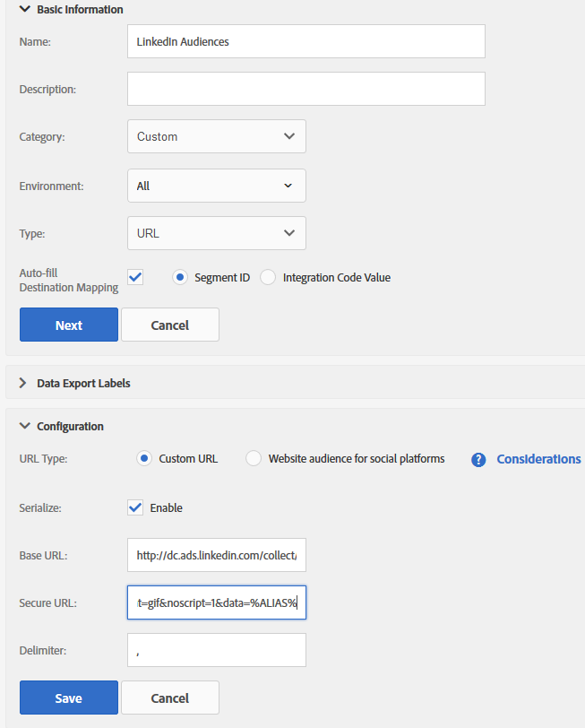

# Integrazione di AAM (Adobe Audience Manager) con LinkedIn

Scopri come creare una destinazione LinkedIn basata su URL nell’AAM (Adobe Audience Manager) per inviare segmenti AAM per il targeting di annunci online.

## Descrizione {#description}

### Ambiente

- Adobe Audience Manager (AAM)
- LinkedIn

### Problema/Sintomi

I segmenti AAM creati nell’interfaccia utente dell’AAM sono pronti per l’assegnazione alla destinazione LinkedIn. Consulta [Creare un segmento](https://experienceleague.adobe.com/docs/audience-manager/user-guide/features/segments/segment-builder.html#create-segment)in Audience Manager Guida utente.

Questo articolo è una guida al processo di creazione di una destinazione basata su URL di LinkedIn allo scopo di inviare segmenti Adobe Audience Manager (AAM) a LinkedIn per il targeting di annunci online.

<b>Nota:</b> Questo metodo rappresenta una soluzione alternativa offerta per aiutarti a sfruttare i segmenti AAM all’interno della piattaforma LinkedIn. Eventuali aggiornamenti o problemi dell’interfaccia utente di LinkedIn devono essere segnalati al rappresentante del tuo account LinkedIn.

## Risoluzione {#resolution}

1. Creare una nuova destinazione URL in AAM denominata *Pubblico linkedIn* con le seguenti impostazioni (vedi la schermata allegata di seguito):
   <b>Informazioni di base </b>

   - Ambiente: tutto
   - Tipo: URL
   - Seleziona &quot;Mappatura destinazione riempimento automatico&quot; e seleziona &quot;ID segmento&quot;.

   <b>Etichette esportazione dati</b>
Impostazione opzionale in base alle tue esigenze
   <b>Configurazione</b>

   - Tipo URL: URL personalizzato
   - Spunta &quot;Serialize&quot; (Serializza)
   - URL di base: il punto in cui si immette il pixel di LinkedIn

   <b>Esempio</b>

   - *URL di base:<b></b>[http://dc.ads.linkedin.com/collect/?pid=XXXXX&amp;fmt=gif&amp;noscript=1&amp;data=%ALIAS%](http://dc.ads.linkedin.com/collect/?pid=XXXXX&amp;amp;fmt=gif&amp;amp;noscript=1&amp;amp;data=%25ALIAS%25)<b>*
   - *URL protetto:</b><b>[https://dc.ads.linkedin.com/collect/?pid=XXXXX&amp;fmt=gif&amp;noscript=1&amp;data=%ALIAS%](https://dc.ads.linkedin.com/collect/?pid=XXXXX&amp;amp;fmt=gif&amp;amp;noscript=1&amp;amp;data=%25ALIAS%25)</b>*

   <b>Dove</b>

   - <b>*pid</b>* : è l’ID partner LinkedIn
   - <b>*%ALIAS%</b>*: è una macro AAM che verrà sostituita dinamicamente con gli ID del segmento AAM per i quali l’utente si qualifica, delimitati dalla virgola &quot;,&quot;

   <b>Esempio di pixel generati dalla pagina</b>
      <u><b><em><a href="https://dc.ads.linkedin.com/collect/?pid=51565&amp;fmt=gif&amp;noscript=1&amp;data=%25ALIAS%25" style="color:#0563c1; text-decoration:underline">https://dc.ads.linkedin.com/collect/?pid=51565&amp;fmt=gif&amp;noscript=1&amp;data=3401321,2993399,3263410</a></em></b></u>
      Questo esempio mostra un utente che rientra in tre segmenti o ID: 3401321, 2993399 e 3263410.
      <b>Esempio di configurazione della destinazione URL</b>
   
2. Assegna il segmento applicabile alla destinazione appena creata. Il valore di mappatura viene compilato automaticamente con l’ID del segmento AAM.
Inserire una data di fine, se applicabile, o lasciare vuoto per non specificare alcuna data di fine.
   

Ora l’AAM attiva selettivamente il pixel di LinkedIn, popolando dinamicamente l’ID segmento, qualificando il rispettivo utente per un pubblico in LinkedIn.
