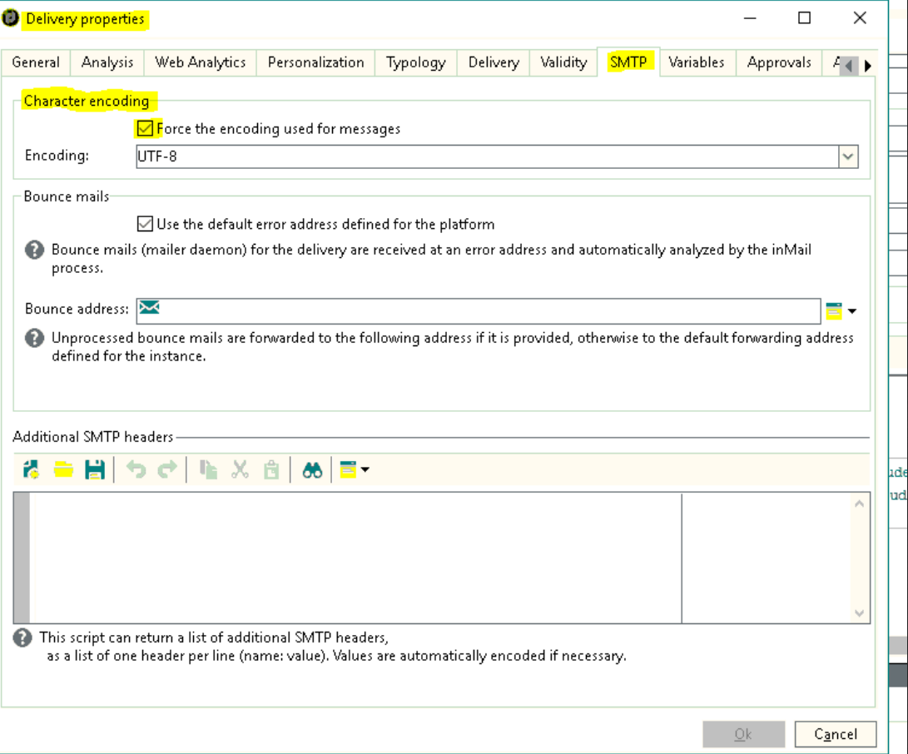

# I set di caratteri nell’opzione di codifica dei caratteri SMTP della campagna non sono visibili

## Descrizione

<b>Ambiente</b>

Adobe Campaign Classic

Adobe Campaign

<b>Problema</b>

I set di caratteri nell’opzione di codifica dei caratteri SMTP di Adobe Campaign in Proprietà consegna non erano visibili.

<b>Causa</b>

La causa è che il database non è un database Unicode.

## Risoluzione

<b>Soluzione</b>

1. La `XtkDatabaseId` nel campo opzione definisce l&#39;ID del database.

   Inizia con una &quot;u&quot; per il database Unicode. Fai riferimento alla [Elenco delle opzioni di Campaign Classic](https://docs.adobe.com/content/help/en/campaign-classic/using/installing-campaign-classic/appendices/configuring-campaign-options.html) nella documentazione di Campaign Classic in Adobe Experience League per ulteriori informazioni.

   

   Ciò significa che se l&#39;ID del database è Unicode, puoi visualizzare quanto segue:

   

1. Quando si modifica la `XtkDatabaseId` nel campo opzione, la parte non è visibile come `IsUnicode()` parte della condizione per non soddisfare nel codice come segue:

   ```
   container type="visibleGroup" visibleIf="EV(@messageType, 'mail') and IsUnicode()"
                     xpath="advancedParameters"
            container label="Character encoding" type="frame"
              input useDesc="true" xpath="@forceCodepage"/
              container type="visibleGroup" visibleIf="@forceCodepage"
                input xpath="@codepage"/
              /container
            /container
          /container
   ```

1. In questo esempio, la collaborazione al database era `Latin1_General_CI_AS`.

   Di conseguenza `XtkDatabaseId` il valore nel campo opzione non veniva da u, ed è per questo che la parte non è visibile.

1. Per ulteriori informazioni sul passaggio a Unicode nei database, vedere [Passaggio a Unicode](https://docs.adobe.com/content/help/en/campaign-classic/using/monitoring-campaign-classic/updating-adobe-campaign/switching-to-unicode.html) nella documentazione di Campaign Classic in Adobe Experience League.
