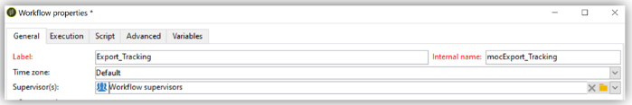

# Best practice per i flussi di lavoro: configurazione e monitoraggio in Campaign Classic

Questo articolo illustra alcune best practice relative alla configurazione e al monitoraggio dei flussi di lavoro in Adobe Campaign Classic.

## Descrizione {#description}

### <b>Ambiente</b>

- Adobe Campaign
- Adobe Campaign Classic

### <b>Problema</b>

Nella maggior parte dei casi, i flussi di lavoro fanno parte delle funzioni di base (integrate o personalizzate) della piattaforma. Per questo motivo, è molto importante prestare attenzione durante la configurazione.

## Risoluzione {#resolution}

### Configurazione generale

#### Organizzazione

Crea i flussi di lavoro, ad esempio importa in tableXXX, in una cartella personalizzata.

Solo se il flusso di lavoro generico influisce sull’intera piattaforma (ad esempio per la pulizia), potresti considerare l’opportunità di aggiungerlo nel file incorporato di <b>Flussi di lavoro tecnici</b> cartella.

#### Nome flusso di lavoro

Come spiegato in precedenza, è molto importante assegnare ai flussi di lavoro nomi ed etichette corretti. Poiché un operatore non fa sempre riferimento alla documentazione, compila il <b>descrizione</b> per riepilogare il processo da eseguire.

Se il flusso di lavoro fa parte di un processo che coinvolge più flussi di lavoro, puoi essere esplicito quando inserisci un’etichetta; l’utilizzo dei numeri è un ottimo modo per ordinare i flussi di lavoro (per Etichetta). Ad esempio:

- 001 - Importazione - Destinatari importazione
- 002 - Importazione - Vendite all’importazione
- 003 - Importazione - Dettagli delle vendite all’importazione
- 010 - Esportazione - Registri di consegna delle esportazioni
- 011 - Esportazione - Registri di tracciamento delle esportazioni

#### Gravità

Configurare la gravità di un flusso di lavoro nelle proprietà del flusso di lavoro in <b>Esecuzione</b> scheda:

- Normale
- Produzione
- Critico

Fornendo queste informazioni durante la creazione di un flusso di lavoro sarà possibile comprendere meglio la gravità del processo configurato.

#### Registri

Il metodo JavaScript `logInfo()` è un’ottima soluzione per il debug di un flusso di lavoro. È utile, ma deve essere utilizzato con attenzione, in particolare per le attività che vengono eseguite di frequente: può sovraccaricare i registri e aumentare in modo significativo le dimensioni della tabella dei registri.

Ma potresti anche aver bisogno di più di `logInfo()`. Sono disponibili due soluzioni aggiuntive.

<b>Mantieni il risultato delle popolazioni provvisorie tra due esecuzioni</b>

Questa opzione, disponibile nelle proprietà del flusso di lavoro&quot; <b>Generale</b> , può essere tanto utile quanto pericoloso. Impedisce ad Adobe Campaign di eliminare le tabelle temporanee create tra due esecuzioni. Sebbene possa essere utile per gli ambienti di sviluppo, è vietato utilizzarlo negli ambienti di produzione e deve essere monitorato. Mantenere le tabelle temporanee potrebbe comportare un aumento significativo delle dimensioni del database e, infine, il raggiungimento del limite di dimensioni. Inoltre, rallenterà il backup.

<b>Nessun flusso di lavoro</b> durante la produzione questa opzione deve essere selezionata in qualsiasi momento.

<b><u>Registra le query SQL nel giornale di registrazione</u>:</b>

Disponibile in <b>Esecuzione</b> nelle proprietà del flusso di lavoro, vengono registrate tutte le query SQL generate dallo strumento dalle diverse attività. È un ottimo modo per vedere cosa viene effettivamente eseguito dalla piattaforma. Tuttavia, questa opzione deve essere utilizzata solo temporaneamente durante lo sviluppo e non deve essere attivata durante la produzione.

#### Monitoraggio

Tutti i flussi di lavoro pianificati in esecuzione negli ambienti di produzione devono essere monitorati per ricevere un avviso in caso di errore.

Nelle proprietà del flusso di lavoro, seleziona una <b>gruppo di supervisori</b>, il gruppo predefinito &quot;Supervisori del flusso di lavoro&quot; o un gruppo personalizzato. Assicurati che almeno un operatore appartenga a questo gruppo, con un messaggio e-mail configurato.

<b><u>Non lasciare i flussi di lavoro in pausa</u>:</b>

Se crei un flusso di lavoro temporaneo, assicurati che possa terminare correttamente e non rimanere in uno stato di &quot;pausa&quot;. Se viene messo in pausa, implicherebbe la necessità di mantenere le tabelle temporanee e quindi aumentare le dimensioni del database.

### Nel flusso di lavoro

#### Nome attività

Durante lo sviluppo del flusso di lavoro, tutte le attività avranno un nome, così come tutti gli oggetti di Adobe Campaign. Mentre il nome viene generato dallo strumento, è consigliabile rinominarlo con un nome esplicito durante la configurazione. Se lo facesse in un secondo momento, potrebbe interrompere il flusso di lavoro con le attività che utilizzano il nome di un’altra attività precedente. Sarebbe quindi difficile aggiornare i nomi in seguito.

Il nome dell’attività si trova nella sezione <b>Avanzate</b> scheda. Non lasciarli denominati query, query1, query11, ma assegna loro nomi espliciti, ad esempio `querySubscribedRecipients`. Questo nome verrà visualizzato nel giornale di registrazione e, se applicabile, nei registri SQL e sarà utile per eseguire il debug del flusso di lavoro durante la configurazione.

#### JavaScript all’interno di un’attività

È possibile aggiungere JavaScript durante l’inizializzazione di un’attività del flusso di lavoro. Questa operazione può essere eseguita nel di <b>Avanzate</b> scheda. Per semplificare l’individuazione del flusso di lavoro, si consiglia di utilizzare i doppi trattini all’inizio e alla fine dell’etichetta dell’attività come segue: *— La mia etichetta —*

#### Segnale

Nella maggior parte dei casi, non saprai da dove viene chiamato il segnale. Per evitare questo problema, utilizza <b>Commento</b> campo all&#39;interno del <b>Avanzate</b> scheda dell’attività del segnale per documentare l’origine prevista di un segnale per questa attività.

#### Aggiornamento del flusso di lavoro

Un flusso di lavoro di produzione non deve essere aggiornato direttamente. A meno che il processo non consista nella creazione di una campagna con flussi di lavoro basati su modelli, i processi devono prima essere testati in un ambiente di sviluppo, se possibile. Solo dopo questa convalida il flusso di lavoro può essere distribuito e avviato in produzione.

I flussi di lavoro archiviati possono essere mantenuti su piattaforme di sviluppo o di test, in un <b>Archiviato</b> ma la produzione deve rimanere il più pulita possibile. I flussi di lavoro precedenti devono essere rimossi dalla produzione se inattivi.
