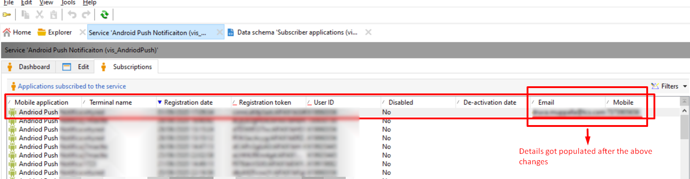

# Parametri aggiuntivi non vengono inseriti in app subscription RCP

## Descrizione

<b>Ambiente</b>
- Campaign
- Campaign Classic

<b>Problema/Sintomi</b>
Abbiamo esteso la tabella RCP di abbonamento all’app. Quando si tenta di inserire dei valori, con le coppie chiave-valore che utilizzano parametri aggiuntivi nei metodi di registrazione del dispositivo, vengono aggiornati solo il token del dispositivo e la chiave utente. Possiamo sapere il motivo per cui i dati non vengono popolati?

## Risoluzione

Le schermate fornite di seguito illustrano che quando si aggiungono parametri aggiuntivi nel *Servizi e abbonamenti* app mobile, uno è in grado di popolare i dettagli dell’e-mail e del numero di telefono.

