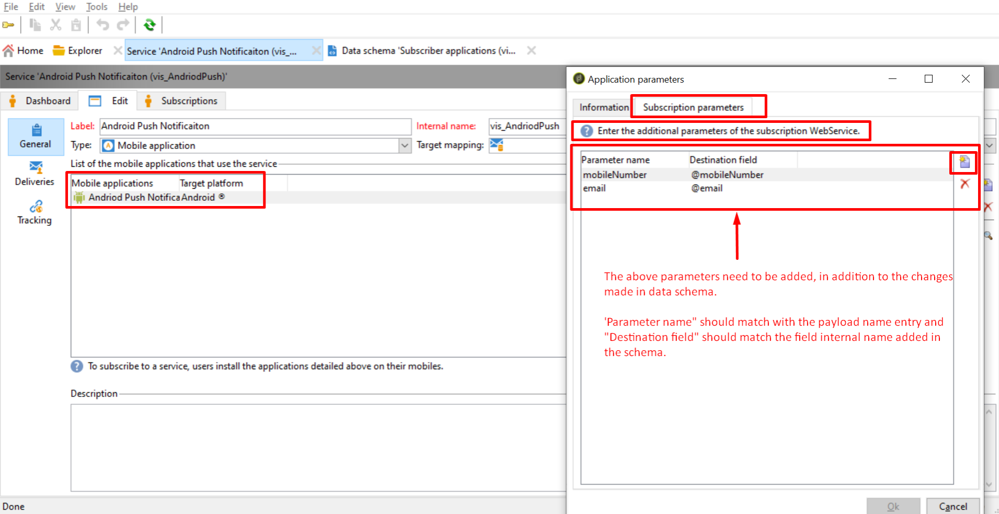

# Parametri aggiuntivi non compilati nell’RCP di abbonamento all’app

## Descrizione

<b>Ambiente</b>
- Campaign
- Campaign Classic

<b>Problema/Sintomi</b>
Abbiamo esteso la tabella RCP dell’abbonamento all’app. Quando si tenta di inserire valori, con le coppie di valori chiave che utilizzano parametri aggiuntivi nei metodi del dispositivo di registrazione, vengono aggiornati solo il token dispositivo e la chiave utente. Controllate attentamente questo e consigliateci, perché i dati non si popolano?

## Risoluzione

Come possiamo vedere nelle seguenti schermate fornite, sull’aggiunta dei parametri aggiuntivi nel *Servizi e abbonamenti* app mobile, siamo stati in grado di popolare i dettagli dell&#39;e-mail e del numero di telefono.

