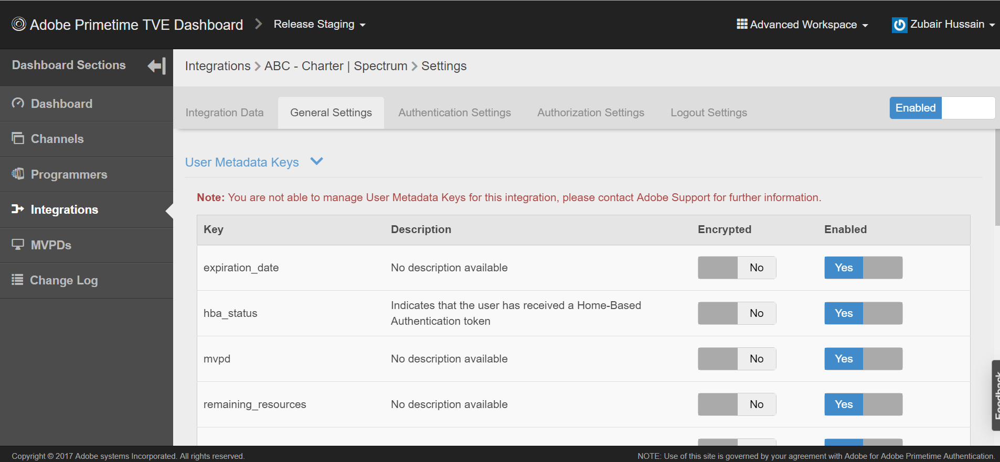

# Come posso verificare se Single Sign-On (SSO) è abilitato o disabilitato?

## Descrizione {#description}

<b>Ambiente</b>
Primetime

<b>Problema/Sintomi</b>
Staging preferenziale, produzione preferenziale, fase di rilascio e produzione di rilascio

Come posso verificare se l&#39;accesso Single Sign-On (SSO) è abilitato o disabilitato per il mio canale?

## Risoluzione {#resolution}

L’accesso Single Sign-On (SSO) è abilitato per impostazione predefinita per tutte le integrazioni, tuttavia può essere configurato in modo che SSO sia disabilitato. Per verificare se SSO è disabilitato, puoi rivedere l&#39;integrazione nella dashboard TVE. I seguenti attributi sono impostati su YES, se SSO è stato disabilitato per un&#39;integrazione Canale - Multichannel Video Programming Distributor (MVPD): 
1. Auth/Aggregator — SÌ
2. Abilita autenticazione passiva - SÌ

Se le impostazioni non sono impostate o impostate su NO, SSO è disponibile per l&#39;integrazione. La modifica di queste impostazioni su NO consente inoltre di abilitare SSO. Puoi trovare queste impostazioni andando alla tua integrazione specifica (assicurati che l&#39;area di lavoro avanzata sia selezionata).
1. Fai clic sull’integrazione specifica nella dashboard TVE.
2. Seleziona la scheda Impostazioni generali e scorri verso il basso.
3. Fai clic sul pulsante <b>*Mostra proprietà aggiuntive</b>* per visualizzare il valore di Auth / Aggregator e Enable Passive AuthN. 
