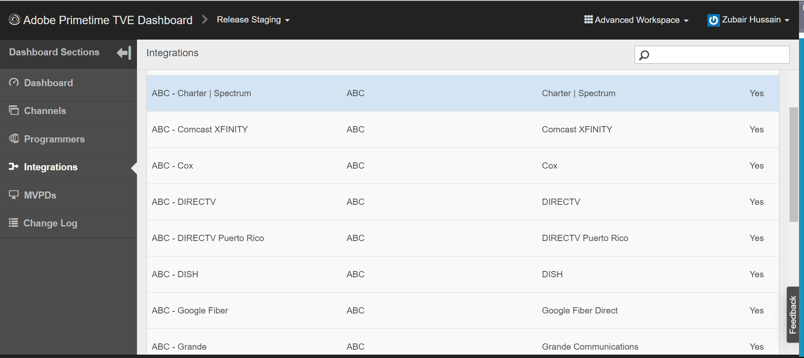

# Come posso verificare se Single Sign-On (SSO) è abilitato o disabilitato?

## Descrizione {#description}

<b>Ambiente</b>
Primetime

<b>Problema/Sintomi</b>
Staging Prequal, Produzione Prequal, Staging Release e Produzione Release

Come posso verificare se il Single Sign-On (SSO) è abilitato o disabilitato per il mio canale?

## Risoluzione {#resolution}

Il Single Sign-On (SSO) è abilitato per impostazione predefinita per tutte le integrazioni, tuttavia può essere configurato in modo che sia disabilitato. Per verificare se SSO è disabilitato, puoi rivedere l’integrazione nel dashboard TVE. I seguenti attributi sono impostati su SÌ se SSO è stato disabilitato per un’integrazione Channel - Multichannel Video Programming Distributor (MVPD): 
1. Auth/Aggregator — SÌ
2. Abilita autenticazione passiva - SÌ

Se le impostazioni non sono impostate o impostate su NO, l&#39;SSO è disponibile per l&#39;integrazione. La modifica di queste impostazioni in NO consente inoltre di abilitare l&#39;SSO. Per trovare queste impostazioni, vai all’integrazione specifica (accertati che sia selezionata l’opzione Area di lavoro avanzata).
1. Fai clic sull’integrazione specifica in Dashboard TVE.
2. Selezionare la scheda Impostazioni generali e scorrere verso il basso.
3. Fai clic sul pulsante <b>*Mostra proprietà aggiuntiva</b>* per visualizzare il valore di Auth / Aggregator e Abilita AuthN passivo. 
