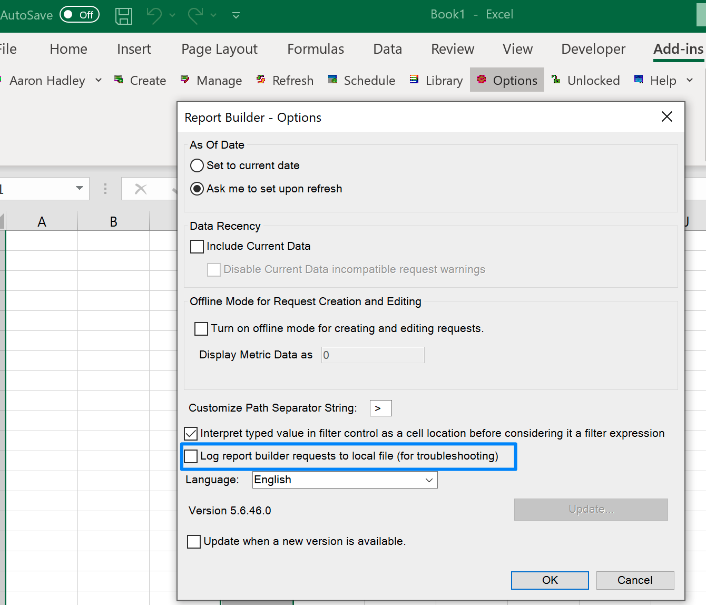

# Analytics - Registrazione dettagliata Report Builder

## Descrizione

<b>Ambiente</b>
- Analytics

<b>Problemi/Sintomi</b>
Come attivare la registrazione in ARB quando si effettua l’accesso per selezionare la casella di registrazione non funziona?

## Risoluzione

Apri Registro di sistema in Windows: [https://support.microsoft.com/en-us/windows/how-to-open-registry-editor-in-windows-10-deab38e6-91d6-e0aa-4b7c-8878d9e07b11](https://support.microsoft.com/en-us/windows/how-to-open-registry-editor-in-windows-10-deab38e6-91d6-e0aa-4b7c-8878d9e07b11)

Trova una delle cartelle seguenti. Il percorso e il nome file potrebbero essere leggermente diversi a seconda della versione del bit ARB, ecc.

Computer\HKEY_LOCAL_MACHINE\SOFTWARE\WOW6432Node\Adobe\ReportBuilder

O

Computer\HKEY_LOCAL_MACHINE\SOFTWARE\Adobe\ReportBuilder

Clic destro

Aggiungi nuova stringa

Immetti nome valore

Immetti i dati Valore di &quot;debug&quot;

