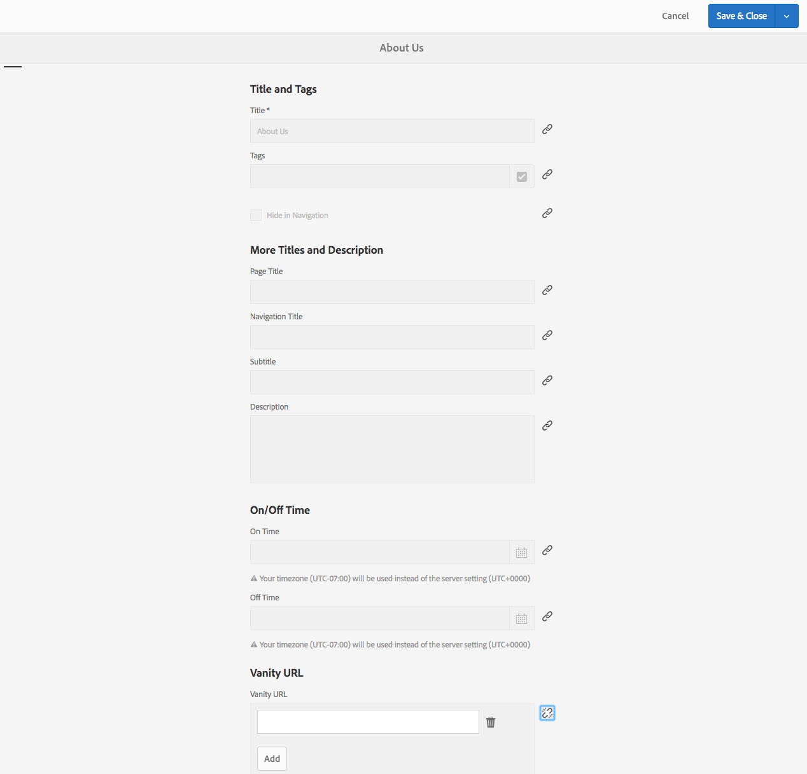

# URL personalizzati del dispatcher | AEM


Questo documento ti aiuterà a capire come Adobe Experience Manager gestisce gli URL personalizzati e le tecniche aggiuntive, ad esempio l’utilizzo di regole di riscrittura per avvicinare il contenuto al limite della consegna.

## Descrizione {#description}


### <b>Ambiente</b>

Adobe Experience Manager


### <b>Problemi/Sintomi</b>

Come si comporta l’AEM con gli URL personalizzati? Esistono tecniche aggiuntive per mappare il contenuto più vicino al limite della distribuzione?

#### Cosa sono gli URL personalizzati?

Se il contenuto risiede in una struttura di cartelle, non sempre si trova in un URL di facile riferimento. Gli URL personalizzati sono come scelte rapide. URL più brevi o univoci che fanno riferimento a dove si trova il contenuto reale.

Ecco un esempio: <b>*/aboutus</b> puntato a <b>/content/we-retail/us/en/about-us.html</b>*

Gli autori dell’AEM possono impostare le proprietà dell’URL personalizzato su un contenuto nell’AEM e pubblicarlo.

Affinché questa funzione funzioni, è necessario regolare i filtri del dispatcher per consentire il reindirizzamento. Questa situazione diventa poco ragionevole se si regolano i file di configurazione del dispatcher alla velocità con cui gli autori dovrebbero impostare queste voci di pagina personalizzate.

Per questo motivo il modulo dispatcher dispone di una funzione che consente automaticamente tutto ciò che è elencato come reindirizzamento nella struttura del contenuto.


## Risoluzione {#resolution}


### Come funziona?

#### Creazione di URL personalizzati

L’autore visita una pagina in AEM, visita le proprietà della pagina e aggiunge voci nella sezione degli URL personalizzati.

Una volta salvate le modifiche e attivata la pagina, il reindirizzamento viene assegnato a essa.

<b><u>Interfaccia utente touch</u>:</b>




<b><u>Finder contenuti classico</u>:</b>


<b>Nota:</b> Ti preghiamo di capire che questo è molto vulnerabile a problemi di spazio dei nomi. Le voci personalizzate sono globali per tutte le pagine, questo è solo uno dei difetti per cui è necessario pianificare soluzioni alternative. Ne spiegheremo alcuni in seguito.

<b><u>Risoluzione/mappatura risorse</u>:</b>

Ogni voce di reindirizzamento è una voce di mappatura sling per un reindirizzamento interno. Queste mappe sono visibili nella console Felix delle istanze dell&#39;AEM (`/system/console/jcrresolver`)

Ecco una schermata della voce di mappa creata da una voce di reindirizzamento:


Nell&#39;esempio precedente quando chiediamo all&#39;istanza AEM di visitare `/aboutus` si risolverà in `/content/we-retail/us/en/about-us.html`

<b><u>Filtri di Dispatcher per l’autorizzazione automatica</u>:</b>

Il Dispatcher in uno stato protetto esclude le richieste nel percorso o nel Dispatcher, perché si tratta della radice della struttura JCR.

È importante assicurarsi che gli editori consentano solo i contenuti `/content` e altri percorsi sicuri ecc... e non percorsi come `/system` ecc.

Questo è il problema: gli URL personalizzati si trovano nella cartella base di /, quindi come possiamo consentire loro di raggiungere gli editori mantenendo la sicurezza?

Semplice, Dispatcher dispone di un meccanismo di filtro automatico per l’autorizzazione. Occorre installare un pacchetto AEM e poi configurare il Dispatcher in modo che punti alla pagina dei pacchetti. Visita [qui](https://experience.adobe.com/#/downloads/content/software-distribution/en/aem.html?package=/content/software-distribution/en/details.html/content/dam/aem/public/adobe/packages/granite/vanityurls-components) per il pacchetto AEM.

Il file farm di Dispatcher contiene una sezione di configurazione:


```
/vanity_urls {      /url    "/libs/granite/dispatcher/content/vanityUrls.html"
  /file   "/tmp/vanity_urls"      /delay  300 }
```


Questa configurazione comunica al Dispatcher di recuperare questo URL dall’istanza AEM che esegue ogni 300 secondi per recuperare l’elenco di elementi che si desidera autorizzare.

Memorizza la cache della risposta nell’argomento /file, quindi in questo esempio /tmp/vanity_urls

Quindi, se visiti l’istanza dell’AEM all’URI, vedrai cosa recupera:


È un elenco molto semplice.

#### Riscrivi regole come regole personalizzate

Perché citare l’utilizzo di regole di riscrittura invece del meccanismo predefinito integrato nell’AEM come descritto sopra?

Semplicemente perché i problemi di spazio dei nomi, le prestazioni e la logica di livello superiore possono essere gestiti meglio.

Passiamo ora a un esempio della voce di reindirizzamento `/aboutus` al suo contenuto `/content/we-retail/us/en/about-us.html` utilizzo di Apache `mod_rewrite` per eseguire questa operazione.

`RewriteRule /aboutus /content/we-retail/us/en/about-us.html PT,L,NC`

Questa regola cerca il reindirizzamento `/aboutus` e recupera il percorso completo dal renderer con il flag PT (Pass Through).

Inoltre, smetterà di elaborare tutte le altre regole con flag L (Last), il che significa che non dovrà elaborare un lungo elenco di regole come nel caso del Resolving JCR.

Oltre a non dover delegare la richiesta e attendere che l’editore dell’AEM risponda, questi due elementi rendono il metodo molto più performante.

La ciliegina sulla torta qui è il flag NC (No Case-Sensitive) che significa che se un cliente sbatte l’URI con `/Aboutus` invece di `/aboutus` funzionerà comunque e consentirà di recuperare la pagina giusta.

Per creare una regola di riscrittura a questo scopo, crea un file di configurazione in Dispatcher (ad esempio: `/etc/httpd/conf.d/rewrites/examplevanity_rewrite.rules`) e includerlo nella `.vhost` file che gestisce il dominio che richiede l’applicazione di questi url personalizzati.

Di seguito è riportato un frammento di codice di esempio da includere all’interno:


```
/etc/httpd/conf.d/enabled_vhosts/we-retail.vhost
 VirtualHost *:80    ServerName    weretail.com    ServerAlias 

www.weretail.com        ........ SNIP ........     IfModule mod_rewrite.c   

   ReWriteEngine    on       LogLevel warn rewrite:info

Include /etc/httpd/conf.d/rewrites/examplevanity_rewrite.rules      / IfModule         
   ........ SNIP ......../VirtualHost
```


### Quale metodo e dove usarlo?

A. L’utilizzo dell’AEM per controllare le voci vanity presenta i seguenti vantaggi:

- Gli autori possono crearli al volo
- Si trovano insieme al contenuto e possono essere confezionati con il contenuto


B. Utilizzo `mod_rewrite` per controllare le voci di reindirizzamento sono disponibili i seguenti vantaggi:

- Risoluzione più rapida dei contenuti
- È più vicino al limite delle richieste di contenuto degli utenti finali
- Maggiore estensibilità e opzioni per controllare il modo in cui il contenuto viene mappato su altre condizioni
- Può non fare distinzione tra maiuscole e minuscole


C. Utilizzare entrambi i metodi, ma ecco i consigli e i criteri su quale utilizzare quando:

- Se il reindirizzamento è temporaneo e prevede bassi livelli di traffico, utilizza la funzione integrata AEM
- Se il reindirizzamento è un endpoint di base che non cambia spesso e che è usato di frequente, utilizza un `mod_rewrite` regola.
- Se lo spazio dei nomi personalizzato (ad esempio: `/aboutus`) deve essere riutilizzato per molti marchi nella stessa istanza AEM e quindi utilizzare le regole di riscrittura.


<b>Nota:</b> Se desideri utilizzare la funzione di reindirizzamento AEM ed evitare lo spazio dei nomi, puoi creare una convenzione di denominazione. Utilizzo di URL personalizzati nidificati come `/brand1/aboutus, brand2/aboutus, brand3/aboutus`
