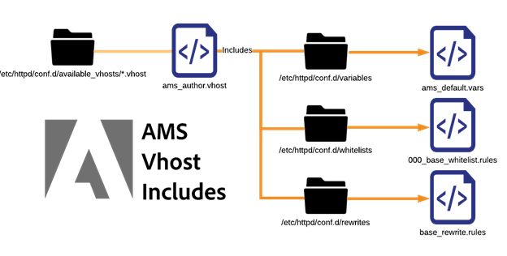
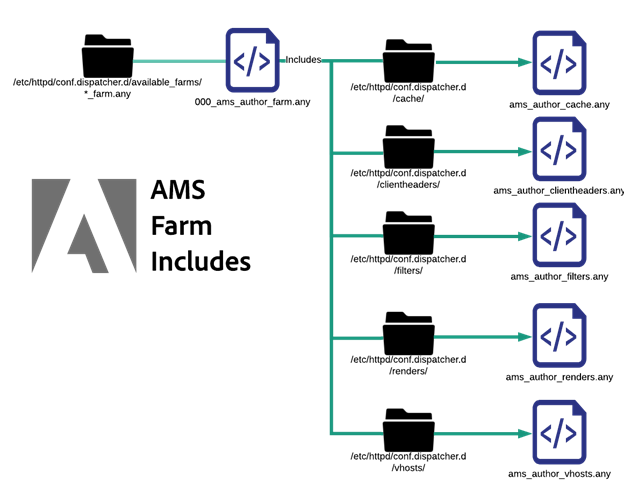

# Spiegazione dei file di configurazione | AEM


Esplora un’analisi approfondita dei file di configurazione nel server Dispatcher di Adobe Managed Services. Scopri il loro significato, le convenzioni di denominazione e le applicazioni pratiche.

## Descrizione {#description}


### Ambiente

Experience Manager

### Problema/Sintomi

Questo documento analizza e spiega tutti i file di configurazione distribuiti in un server dispatcher standard fornito in Adobe Managed Services. Il loro utilizzo, le convenzioni di denominazione, ecc.

<b>Convenzione di denominazione</b>

Apache Webserver non si preoccupa effettivamente dell’estensione di un file quando esegue il targeting con un’istruzione include o include optional. Assegnare nomi corretti che eliminino conflitti e confusione aiuta molto. I nomi utilizzati descrivono l’ambito di applicazione del file per facilitarne l’utilizzo. Se tutto si chiama .conf questo diventa davvero confuso. Vogliamo evitare file ed estensioni con nomi errati.

Di seguito è riportato un elenco delle diverse estensioni di file personalizzati e convenzioni di denominazione utilizzate in un tipico dispatcher configurato AMS.

<u>File contenuti in conf.d/</u>


| File | Destinazione file | Descrizione |
| --- | --- | --- |
| `<` NOME FILE`>` .conf | /etc/httpd/conf.d/ | Un’installazione predefinita di Enterprise Linux utilizza questa estensione di file e include la cartella come posizione per ignorare le impostazioni in httpd.conf e consentire di aggiungere funzionalità aggiuntive a livello globale in Apache. |
| `<` NOME FILE`>` .vhost | In prova: /etc/httpd/conf.d/available_vhosts/<br><br>Attivo:<br><br>/etc/httpd/conf.d/enabled_vhosts/<br><br><u style="box-sizing: border-box; border: 0 none">*Nota: i file .vhost non devono essere copiati nella cartella enabled_vhosts ma utilizzano symlink per un percorso relativo del file available_vhosts/ .vhost</u> | I file \*.vhost (Virtual Host) sono `<` VirtualHosts `>`  voci corrispondenti ai nomi host e che consentono ad Apache di gestire ogni traffico di dominio con regole diverse. Dal file .vhost, verranno inclusi altri file come riscritture, whitelisting, ecc. |
| `<` NOME FILE`>` _rewrite.rules | /etc/httpd/conf.d/rewrites/ | `*_rewrite.rules` archivio file `mod_rewrite` regole da includere e utilizzare esplicitamente in un file vhost |
| `<` NOME FILE`>` _whitelist.rules | /etc/httpd/conf.d/whitelists/ | \*_ipwhitelist.rules sono inclusi nei file \*.vhost. Contiene IP regex o consente regole di negazione per consentire l’inserimento di IP nella whitelist. Se si tenta di limitare la visualizzazione di un host virtuale basato su indirizzi IP, verrà generato uno di questi file e verrà incluso nel file \*.vhost |


<u>File contenuti in conf.module.d/</u>


| File | Destinazione file | Descrizione |
| --- | --- | --- |
| `<` NOME FILE`>` .any | /etc/httpd/conf.dispatcher.d/ | Il modulo Apache del Dispatcher AEM recupera le impostazioni dai file \*.any. Il file di inclusione padre predefinito è conf.dispatcher.d/dispatcher.any |
| `<` NOME FILE`>` _farm.any | <u>In staging</u>:<br><br>/etc/httpd/conf.dispatcher.d/available_farms/<br><br><u>Attivo</u>:<br><br>/etc/httpd/conf.dispatcher.d/enabled_farms/<br><br><u style="box-sizing: border-box; border: 0 none">*Nota: questi file farm non devono essere copiati nella cartella enabled_farms ma utilizzano i collegamenti simbolici a un percorso relativo del file available_farms/ _farm.any</u> | \*_i file farm.any sono inclusi nel file conf.dispatcher.d/dispatcher.any. Questi file della farm padre consentono di controllare il comportamento del modulo per ogni tipo di rendering o sito Web. I file vengono creati nella directory available_farms e abilitati con un collegamento simbolico nella directory enabled_farms.<br><br>Li include automaticamente per nome dal file dispatcher.any.<br><br>I file della farm della linea di base iniziano con 000_ per assicurarsi che vengano caricati per primi.<br><br>I file farm personalizzati devono essere caricati dopo avviando il loro schema numerico su 100_ per garantire il corretto comportamento di inclusione. |
| `<` NOME FILE`>` _filters.any | /etc/httpd/conf.dispatcher.d/filters/ | \*_filters.any sono inclusi nei file conf.dispatcher.d/enabled_farms/\*_farm.any. Ogni farm dispone di un set di regole che modificano il traffico da filtrare e non da inviare ai renderer. |
| `<` NOME FILE`>` _vhosts.any | /etc/httpd/conf.dispatcher.d/vhosts/ | I file \*_vhosts.any sono inclusi nei file conf.dispatcher.d/enabled_farms/\*_farm.any. Questi file sono un elenco di nomi host o percorsi URI a cui deve corrispondere la corrispondenza BLOB per determinare quale renderer utilizzare per soddisfare tale richiesta |
| `<` NOME FILE`>` _cache.any | /etc/httpd/conf.dispatcher.d/cache/ | \*_cache.any i file sono inclusi nei file conf.dispatcher.d/enabled_farms/\*_farm.any. Questi file specificano quali elementi vengono memorizzati in cache e quali no |
| `<` NOME FILE`>` _invalidate_allowed.any | /etc/httpd/conf.dispatcher.d/cache/ | \*_invalidate_allowed.any I file sono inclusi nei file conf.dispatcher.d/enabled_farms/\*_farm.any. Specificano gli indirizzi IP autorizzati a inviare richieste di scaricamento e invalidamento. |
| `<` NOME FILE`>` _clientheaders.any | /etc/httpd/conf.dispatcher.d/clientheaders/ | \*_clientheaders.any i file sono inclusi nei file conf.dispatcher.d/enabled_farms/\*_farm.any. Specificano le intestazioni client da trasmettere a ogni renderer. |
| `<` NOME FILE`>` _renders.any | /etc/httpd/conf.dispatcher.d/renders/ | I file \*_renders.any sono inclusi nei file conf.dispatcher.d/enabled_farms/\*_farm.any. Specificano le impostazioni IP, porta e timeout per ciascun renderer. Un renderer appropriato può essere un server livecycle o qualsiasi sistema AEM da cui il dispatcher può recuperare o inoltrare le richieste |


<b>Problemi evitati</b>

Quando si segue la convenzione di denominazione è possibile evitare alcuni errori abbastanza facili da commettere che possono avere risultati catastrofici. Seguiremo alcuni esempi.

<u>Esempio di problema</u>

Come esempio di sito per ExampleCo, due file di configurazione sono stati creati dagli sviluppatori delle configurazioni del dispatcher.

`/etc/httpd/conf.d/exampleco.conf`


```
<VirtualHost *:80>

    ServerName  "exampleco"

    ServerAlias "www.exampleco.com"

    .......... SNIP ...............

    <IfModule mod_rewrite.c>

        ReWriteEngine   on

        LogLevel warn rewrite:trace1

        Include /etc/httpd/conf.d/rewrites/exampleco.conf

    </IfModule>

</VirtualHost>
```


`/etc/httpd/conf.d/rewrites/exampleco.conf`


```
RewriteRule /$ /content/exampleco/en.html [ PT,L] 

RewriteRule /robots.txt$ /content/dam/exampleco/robots.txt [ PT,L]
```


<b>PERICOLO POTENZIALE</b>

<b>A. I nomi dei file sono gli stessi</b>

Se il file vhost viene inserito accidentalmente nella cartella di riscrittura e il file di riscrittura viene inserito nella cartella vhosts. Sembra essere implementato correttamente dal nome file, ma Apache genera un errore e il problema non sarà immediatamente evidente.

<b>In che modo questo diventa un problema?</b>

Se i due file vengono scaricati nella stessa posizione, possono sovrascrivere se stessi o renderli indistinguibili, rendendo il processo di distribuzione un incubo.

<b>B. Le estensioni dei file sono le stesse e sono soggette ad inclusione automatica</b>

Le estensioni dei file sono le stesse e utilizzano l’estensione inclusa automaticamente, in base alla quale Apache includerà automaticamente eventuali file .conf in molte delle sue cartelle predefinite.

<b>In che modo questo diventa un problema?</b>

Se il file vhost con estensione .conf viene inserito nella cartella /etc/httpd/conf.d/, tenta di caricarlo in memoria su Apache, il che è in genere corretto, ma se il file delle regole di riscrittura con estensione .conf viene inserito nella cartella `/etc/httpd/conf.d/` , verrà incluso automaticamente e verrà applicato a livello globale causando risultati confusi e indesiderati.


## Risoluzione {#resolution}


Denomina i file in base alle operazioni eseguite e in modo sicuro fuori dallo spazio dei nomi delle regole di inclusione automatica.

- Se si tratta di un nome di file host virtuale con `.vhost` come estensione.
- Se si tratta di un file di regole di riscrittura, denominalo con `<site>_rewrite.rules` come suffisso ed estensione. Questa convenzione per i nomi chiarirà a quale sito appartenga e se si tratta di un insieme di regole di riscrittura.
- Se si tratta di un file di regole della whitelist IP, denominalo `<description>_whitelist.rules` come suffisso ed estensione. Questa convenzione per i nomi fornirà una descrizione del suo scopo e del fatto che si tratta di un set di regole di corrispondenza IP.


L’utilizzo di queste convenzioni di denominazione evita problemi, se un file viene spostato in una directory di inclusione automatica a cui non appartiene.

Ad esempio, inserendo un file denominato con estensione rules, any o vhost nella cartella di inclusione automatica di `/etc/httpd/conf.d/` non avrebbe alcun effetto.

Se la richiesta di modifica della distribuzione riporta `please deploy exampleco_rewrite.rules to production dispatchers` la persona che distribuisce le modifiche può già sapere che non sta aggiungendo un nuovo sito; sta semplicemente aggiornando le regole di riscrittura come indicato dal nome file.

<b>Includi ordine</b>

Quando si estendono funzionalità e configurazioni in Apache Webserver installato su Enterprise Linux si hanno alcune <b>includi ordini</b> vorrete capire.

R. <u>La linea di base di Apache include</u>

Il file binario di Apache inizia con `httpd.conf` che esegue un `includeoptional` al `conf.d/*.conf` e `conf.modules.d/*.conf` directory.


Come mostrato nel diagramma precedente, il file binario httpd cerca solo il file `httpd.conf` file come file di configurazione. Tale file contiene le seguenti istruzioni:


```
Include conf.modules.d/*.conf
IncludeOptional conf.d/*.conf
```


B. <u>Include il primo livello di AMS</u>

Quando abbiamo applicato il nostro standard abbiamo aggiunto alcuni tipi di file aggiuntivi e include.

Di seguito sono elencate le directory della linea di base di AMS e i principali livelli di inclusione


Basandoci sulla linea di base di Apache, mostriamo in che modo AMS ha creato alcune cartelle aggiuntive e include il livello superiore per `conf.d` cartelle e directory specifiche del modulo nidificate in `/etc/httpd/conf.dispatcher.d/`

Al caricamento di Apache, esegue il pull in `/etc/httpd/conf.modules.d/02-dispatcher.conf` e tale file includerà il file binario `/etc/httpd/modules/mod_dispatcher.so` nel suo stato di esecuzione.


```
LoadModule dispatcher_module modules/mod_dispatcher.so
```


Per utilizzare il modulo in `</VirtualHost>` un file di configurazione viene rilasciato in `/etc/httpd/conf.d/` denominato `dispatcher_vhost.conf` e all&#39;interno di questo file vedrai l&#39;utilizzo di setup dei parametri di base necessari per il funzionamento del modulo:


```
<IfModule disp_apache2.c>
DispatcherConfig conf.dispatcher.d /dispatcher .any
...SNIP...
</IfModule>
```


Come puoi notare qui sopra, il file include il file di livello superiore dispatcher.any del modulo dispatcher per raccogliere i file di configurazione da `/etc/httpd/conf.dispatcher.d/dispatcher.any`

Presta attenzione al contenuto di questo file:


```
/farms {
 $include "enabled_farms/*_farm.any"
}
```


Il file dispatcher.any di livello superiore include tutti i file di farm abilitati che risiedono in `/etc/httpd/conf.dispatcher.d/enabled_farms/` con il nome file di `<FILENAME>_farm.any` che segue la nostra convenzione di denominazione standard.

Più avanti nel `dispatcher_vhost.conf` file menzionato in precedenza viene inoltre eseguita un&#39;istruzione include per abilitare tutti i file host virtuali abilitati che risiedono in `/etc/httpd/conf.d/enabled_vhosts/` con il nome file di `<FILENAME>.vhost` che segue la nostra convenzione di denominazione standard.


```
IncludeOptional /etc/httpd/conf.d/enabled_vhosts/*.vhost
```


In ciascuno dei nostri file .vhost noterai che il modulo dispatcher viene inizializzato come gestore di file predefinito per una directory. Ecco un esempio di file .vhost per mostrare la sintassi:


```
<VirtualHost *:80>
 ServerName "weretail"
 ServerAlias www.weretail.com weretail.com
 <Directory />
 <IfModule disp_apache2.c>
 ....SNIP....
 SetHandler dispatcher-handler
 </IfModule>
 ....SNIP....
 </Directory>
 ....SNIP....
</VirtualHost>
```


Dopo che il livello superiore include la risoluzione, hanno altre inclusioni secondarie che vale la pena menzionare. Ecco un diagramma di alto livello su come i file farm e vhosts includono altri elementi secondari

C. <u>AMS Virtual Host include</u>



Quando un file .vhost `/etc/httpd/conf.d/availabled_vhosts/` directory get symlinked in `/etc/httpd/conf.d/enabled_vhosts/` verranno utilizzati nella configurazione in esecuzione.

I file .vhost hanno inclusioni secondarie in base ai pezzi comuni che abbiamo trovato. Cose come variabili, whitelist e regole di riscrittura.

Il file .vhost includerà istruzioni per ciascun file in base alla posizione in cui devono essere incluse nel file .vhost. Di seguito è riportato un esempio di sintassi di un file .vhost come buon riferimento:


```
Include /etc/httpd/conf .d /variables/weretail .vars VirtualHost *:80
ServerName "${MAIN_DOMAIN}"
Directory / Include /etc/httpd/conf .d /whitelists/weretail *_whitelist.rules
IfModule disp_apache2.c
....SNIP....
SetHandler dispatcher-handler
/IfModule
....SNIP....
/Directory
....SNIP....
IfModule mod_rewrite.c
ReWriteEngine on
LogLevel warn rewrite:trace1
Include /etc/httpd/conf .d /rewrites/weretail_rewrite .rules
/IfModule /VirtualHost
```


Come puoi vedere nell’esempio precedente, esiste un’inclusione per le variabili necessarie in questo file di configurazione che vengono successivamente utilizzate.

All’interno del file `/etc/httpd/conf.d/variables/weretail.vars` possiamo vedere quali variabili sono definite:


```
Define MAIN_DOMAIN dev.weretail.com
```


È inoltre possibile visualizzare una riga che include un elenco di file whitelist.rules che limitano gli utenti autorizzati a visualizzare il contenuto in base a criteri diversi. Esaminiamo il contenuto di uno dei file della whitelist `/etc/httpd/conf.d/whitelists/weretail_mainoffice_whitelist.rules`:


```
<RequireAny>
 Require ip 192.150.16.0/23
</RequireAny>
```


È inoltre possibile visualizzare una riga che include un set di regole di riscrittura. Diamo un&#39;occhiata al contenuto della `weretail_rewrite.rules` file:


```
RewriteRule /robots.txt$ /content/dam/weretail/robots.txt [ NC,PT] 
RewriteCond %{SERVER_NAME} brand1.weretail.net [ NC] 
RewriteRule /favicon.ico$ /content/dam/weretail/favicon.ico [ NC,PT] 
RewriteCond %{SERVER_NAME} brand2.weretail.com [ NC] 
RewriteRule /sitemap.xml$ /content/weretail/general/sitemap.xml [ NC,PT] 
RewriteRule /logo.jpg$ /content/dam/weretail/general/logo.jpg [ NC,PT]
```


D. <u>La farm AMS include</u>



Quando `<FILENAME>_farm.any` file da `/etc/httpd/conf.dispatcher.d/available_farms/` directory get symlinked in `/etc/httpd/conf.dispatcher.d/enabled_farms/` verranno utilizzati nella configurazione in esecuzione.

I file della farm hanno inclusioni secondarie basate su [sezioni di primo livello della farm](https://experienceleague.adobe.com/docs/experience-manager-dispatcher/using/configuring/dispatcher-configuration.html?lang=en#defining-farms-farms) come cache, clientheaders, filtri, rendering e vhosts.

Il `<FILENAME>_farm.any` i file avranno istruzioni di inclusione per ciascun file in base alla posizione in cui devono essere inclusi nel file farm. Esempio di sintassi di un `<FILENAME>_farm.any` come riferimento valido:


```
/weretailfarm {
 /clientheaders {
 $include "/etc/httpd/conf.dispatcher.d/clientheaders/ams_publish_clientheaders.any"
 $include "/etc/httpd/conf.dispatcher.d/clientheaders/ams_common_clientheaders.any"
 }
 /virtualhosts {
 $include "/etc/httpd/conf.dispatcher.d/vhosts/weretail_vhosts.any"
 }
 /renders {
 $include "/etc/httpd/conf.dispatcher.d/renders/ams_publish_renders.any"
 }
 /filter {
 $include "/etc/httpd/conf.dispatcher.d/filters/ams_publish_filters.any"
 $include "/etc/httpd/conf.dispatcher.d/filters/weretail_search_filters.any"
 }
 ....SNIP....
 /cache {
 ....SNIP....
 /rules {
 $include "/etc/httpd/conf.dispatcher.d/cache/ams_publish_cache.any"
 }
 ....SNIP....
 /allowedClients {
 /0000 {
 /glob "*.*.*.*"
 /type "deny"
 }
 $include "/etc/httpd/conf.dispatcher.d/cache/ams_publish_invalidate_allowed.any"
 }
 ....SNIP....
 }
}
```


Poiché è possibile vedere ogni sezione per la farm weretail invece di avere tutta la sintassi necessaria, si utilizza invece un’istruzione &quot;include&quot;.

Vediamo la sintassi di alcuni di questi include per capire come apparirebbe ogni sotto include `/etc/httpd/conf.dispatcher.d/vhosts/weretail_publish_vhosts.any`:


```
"brand1.weretail.com"
"brand2.weretail.com"
"www.weretail.comf"
```


Come puoi vedere, si tratta di un nuovo elenco di nomi di dominio separati da righe che deve essere riprodotto da questa farm rispetto agli altri.

Ora vediamo il `/etc/httpd/conf.dispatcher.d/filters/weretail_search_filters.any`:


```
/400 { /type "allow" /method "GET" /path "/bin/weretail/lists/*" /extension "json" }
/401 { /type "allow" /method "POST" /path "/bin/weretail/search/" /extension "html" }
```
