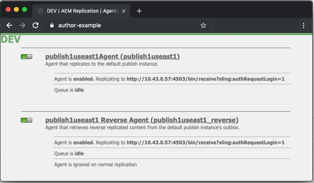
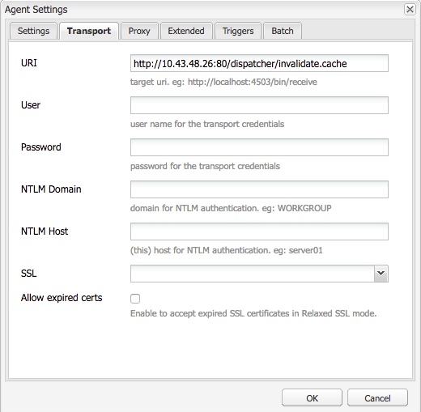

# Adobe di scaricamento del dispatcher Managed Services

Scopri le sfaccettature dei meccanismi di svuotamento della cache e dei flussi di lavoro di attivazione dei contenuti, essenziali per mantenere l’efficienza del sistema e l’integrità dei dati.

## Descrizione {#description}

### <b>Ambiente</b>

Experience Manager

### <b>Problema/Sintomi</b>

Questo documento fornisce indicazioni su come avviene lo scaricamento e spiega il meccanismo che esegue lo scaricamento e l’invalidazione della cache.
  Come funziona 
<b>Ordine delle operazioni</b>

Il flusso di lavoro tipico è meglio descritto quando gli autori di contenuti attivano una pagina, quando l’editore riceve il nuovo contenuto innesca una richiesta di scaricamento al dispatcher come mostrato nel diagramma seguente:

Questo concatenamento di eventi evidenzia che gli elementi vengono scaricati solo quando sono nuovi o sono stati modificati.  In questo modo il contenuto viene ricevuto dall’editore prima di cancellare la cache per evitare race condition in cui lo scaricamento potrebbe verificarsi prima che le modifiche possano essere prelevate dall’editore.

### <b>Agenti di replica</b>

Sull’autore c’è un agente di replica configurato per indicare all’editore che quando qualcosa viene attivato si attiva per inviare il file e tutte le sue dipendenze all’editore.

Quando l’editore riceve il file, ha un agente di replica configurato per puntare al dispatcher che si attiva sull’evento al ricevimento.  Successivamente, serializza una richiesta di scaricamento e la invia al dispatcher.

#### AGENTE DI REPLICA AUTORE

Di seguito sono riportati alcuni esempi di schermate di un agente di replica standard configurato:

In genere sono configurati 1 o 2 agenti di replica sull’autore per ogni editore a cui replicano il contenuto.

Il primo è l’agente di replica standard che invia le attivazioni dei contenuti a.

Il secondo è l&#39;agente inverso.  Questo è facoltativo ed è impostato per controllare la casella in uscita di ogni editore per vedere se ci sono nuovi contenuti da richiamare nell’autore come attività di replica inversa

#### AGENTE DI REPLICA DEL SERVER DI PUBBLICAZIONE

Ecco un esempio di schermate di un agente di replica di scaricamento standard configurato:

#### REPLICA DI SVUOTAMENTO DEL DISPATCHER CHE RICEVE L’HOST VIRTUALE

Il modulo dispatcher cerca intestazioni particolari per sapere se una richiesta POST è da passare ai rendering AEM o se si tratta di una richiesta serializzata come richiesta di scaricamento e deve essere gestita dal gestore del dispatcher stesso.  Ecco una schermata della pagina di configurazione che mostra questi valori:

La pagina di impostazione predefinita mostra <b>Tipo di serializzazione</b> as *Scaricamento del Dispatcher* e imposta il livello di errore:

Nella scheda di trasporto è possibile vedere l’URI impostato per indicare l’indirizzo IP del dispatcher che riceverà le richieste di scaricamento.  Il percorso /dispatcher/invalidate.cache non è il modo in cui il modulo determina se si tratta di uno scaricamento, è solo un endpoint ovvio che puoi vedere nel registro di accesso per sapere se si tratta di una richiesta di scaricamento.  Nella scheda Extended esamineremo gli elementi presenti per qualificare questa è una richiesta di scaricamento al modulo del dispatcher.

Il metodo HTTP per le richieste di scaricamento è solo una richiesta GET con alcune intestazioni di richiesta speciali:

- CQ-Action

  Questa utilizza una variabile AEM basata sulla richiesta e il valore è tipicamente *attivare o eliminare* 

- CQ-Handle Utilizza una variabile AEM basata sulla richiesta e il valore è tipicamente il percorso completo dell’elemento scaricato, ad esempio */content/dam/logo.jpg*

- CQ-Path

  Questa utilizza una variabile AEM basata sulla richiesta e il valore è tipicamente il percorso completo dell’elemento scaricato, ad esempio */content/dam*

- Host

  Qui l’intestazione host viene modificata per eseguire il targeting di un `<` VirtualHost`>`  configurato sul server web Apache di Dispatcher (/etc/httpd/conf.d/enabled_vhosts/aem_flush.vhost).  È un valore in codice rigido che corrisponde a una voce nel file aem_flush.vhost *NomeServer* o *Alias server*

  

  Nella scheda trigger prenderemo nota dei trigger attivati che usiamo e cosa sono

- <b>Ignora predefinito</b>

  Questa opzione è abilitata in modo che l’agente di replica non venga attivato al momento dell’attivazione di una pagina.  Questo avviene quando un’istanza Autore doveva apportare una modifica a una pagina innescando uno scaricamento.  Trattandosi di un editore, non vogliamo innescare questo tipo di evento.

- <b>Alla ricezione</b>

  Quando si riceve un nuovo file, si desidera attivare uno scaricamento.  Quindi, quando l’autore ci invia un file aggiornato, attiveremo e invieremo una richiesta di scaricamento a Dispatcher.

- <b>Nessun controllo delle versioni</b>

  Questa opzione è selezionata per evitare che l’editore generi nuove versioni perché è stato ricevuto un nuovo file.  Sostituiremo semplicemente il file che abbiamo e ci affidiamo all’autore per tenere traccia delle versioni invece che all’editore.

Ora, se guardiamo a come appare una tipica richiesta di scaricamento sotto forma di un comando curl
          

| `$ curl \``-H``"CQ-Action: Activate"` `\``-H``"CQ-Handle: /content/dam/logo.jpg"` `\``-H``"CQ-Path: /content/dam/"` `\``-H``"Content-Length: 0"` `\``-H``"Content-Type: application/octect-stream"` `\``-H``"Host: flush"` `\``http:``//10``.43.0.32:80``/dispatcher/invalidate``.cache` |
| --- |

Questo esempio di scaricamento scarica il percorso /content/dam aggiornando il file .stat in tale directory.

### Il file .stat

Il meccanismo di scaricamento è semplice e vogliamo spiegare l&#39;importanza del <b>.stat</b> file generati nella directory principale dei documenti in cui vengono creati i file della cache.

All’interno dei file .vhost e _farm.any configuriamo una direttiva document root per specificare dove si trova la cache e dove memorizzare/elaborare i file da quando arriva una richiesta da un utente finale.

Se dovessi eseguire il seguente comando sul server dispatcher, inizieresti trovando i file .stat

| 1 | `$``find` `/mnt/var/www/html/` `-``type` `f -name``".stat"` |
| --- | --- |

#### Ecco un diagramma che mostra come apparirà questa struttura di file quando si hanno elementi nella cache e una richiesta di scaricamento inviata ed elaborata dal modulo dispatcher:

#### 

 LIVELLO DEL FILE STAT

In ogni directory era presente un file .stat.  Questo è un indicatore che si è verificato uno scaricamento.  Nell’esempio precedente <b>livello file stat</b> è stato impostato su <b>3</b> all’interno del file di configurazione della farm corrispondente.

L’impostazione del livello del file stat indica quante cartelle in fondo al modulo attraversano e aggiornano un file .stat.  Il file .stat è vuoto, non è altro che un nome file con un timbro data e potrebbe anche essere creato manualmente, ma eseguendo il comando touch sulla riga di comando del server dispatcher.

Se l’impostazione del livello del file stat è troppo alta, ogni richiesta di scaricamento attraversa la struttura della directory toccando i file stat.  Questo può diventare un problema importante per le prestazioni su grandi strutture di cache e può influire sulle prestazioni complessive del dispatcher.

Se si imposta questo livello di file su un valore troppo basso, una richiesta di scaricamento potrebbe cancellare più di quanto previsto.  Il che, a sua volta, causerebbe un abbandono della cache più frequente con un minor numero di richieste distribuite dalla cache e potrebbe causare problemi di prestazioni.

Nota:

Impostare il livello statfilelevel a un livello ragionevole.  Osserva la struttura delle cartelle e accertati che sia configurata in modo da consentire scaricamenti concisi senza dover attraversare troppe directory.   Testalo e assicurati che sia adatto alle tue esigenze durante un test delle prestazioni del sistema.

Un buon esempio è un sito che supporta le lingue.  La struttura ad albero tipica dei contenuti avrebbe le seguenti directory

/content/brand1/en/us/

In questo esempio, utilizza un’impostazione del livello del file stat pari a 4.  In questo modo, quando esegui uno scaricamento del contenuto che si trova sotto <b>us</b> in modo da non scaricare anche le cartelle delle lingue.

#### STAT FILE TIMESTAMP HANDSHAKE

Quando una richiesta di contenuto arriva nella stessa routine, si verifica

1. La marca temporale del file .stat viene confrontata con la marca temporale del file richiesto
2. Se il file .stat è più recente del file richiesto, elimina il contenuto memorizzato in cache, ne recupera uno nuovo dall’AEM e lo memorizza in cache.  Quindi fornisce il contenuto
3. Se il file .stat è più vecchio del file richiesto, sa che il file è nuovo e può elaborare il contenuto.

#### CACHE HANDSHAKE - ESEMPIO 1

Nell’esempio precedente una richiesta per il contenuto /content/index.html

L’ora del file index.html è 2019-11-01 @ 6:21PM

L’ora del file .stat più vicino è 2019-11-01 @ 12:22PM

In base a quanto detto in precedenza, puoi notare che il file di indice è più recente del file .stat e viene distribuito dalla cache all’utente finale che lo ha richiesto

#### CACHE HANDSHAKE - ESEMPIO 2

Nell’esempio precedente una richiesta per il contenuto /content/dam/logo.jpg

L’ora del file logo.jpg è 2019-10-31 @ 1:13PM

L’ora del file .stat più vicino è 2019-11-01 @ 12:22PM

Come puoi vedere in questo esempio, il file è più vecchio del file .stat e verrà rimosso e uno nuovo estratto dall’AEM per sostituirlo nella cache prima di essere servito all’utente finale che lo ha richiesto.
    Impostazioni file farm    
La documentazione qui presente è valida per tutte le opzioni di configurazione: [https://docs.adobe.com/content/help/en/experience-manager-dispatcher/using/configuring/dispatcher-configuration.html#configuring-dispatcher_configuring-the-dispatcher-cache-cache](https://docs.adobe.com/content/help/en/experience-manager-dispatcher/using/configuring/dispatcher-configuration.html#configuring-dispatcher_configuring-the-dispatcher-cache-cache)

Vogliamo evidenziarne alcune che riguardano lo scaricamento della cache

### Directory principale documento

Questa voce di configurazione è contenuta nella seguente sezione del file farm:
          

| `/myfarm {``    ``/cache {``        ``/docroot` |
| --- |

Specifica la directory in cui vuoi che il dispatcher si popola e che desideri gestire come directory cache.

Nota:

Questa directory deve corrispondere all’impostazione radice dei documenti Apache per il dominio per cui il server web è configurato per l’uso.

Annidare le cartelle docroot in ogni farm che si trova in una sottocartella della directory principale dei documenti Apache è una pessima idea per molti motivi.

### Livello file stat

Questa voce di configurazione è contenuta nella seguente sezione del file farm:
          

| `/myfarm {``    ``/cache {``        ``/statfileslevel` |
| --- |

        
Questa impostazione misura a quale profondità i file .stat dovranno essere generati quando arriva una richiesta di scaricamento.

/statfileslevel impostato al seguente numero con document root di /var/www/html/ avrebbe i seguenti risultati durante lo scaricamento di /content/dam/brand1/en/us/logo.jpg

- 0 - Creazione dei seguenti file stat
   - /var/www/html/.stat
- 1 - Creazione dei seguenti file stat
   - /var/www/html/.stat
   - /var/www/html/content/.stat
- 2 - Creazione dei seguenti file stat
   - /var/www/html/.stat
   - /var/www/html/content/.stat
   - /var/www/html/content/dam/.stat
- 3 - Creazione dei seguenti file stat

   - /var/www/html/.stat
   - /var/www/html/content/.stat
   - /var/www/html/content/dam/.stat
   - /var/www/html/content/dam/brand1/.stat
- 4 - Creazione dei seguenti file stat

   - /var/www/html/.stat
   - /var/www/html/content/.stat
   - /var/www/html/content/dam/.stat
   - /var/www/html/content/dam/brand1/.stat
   - /var/www/html/content/dam/brand1/en/.stat
- 5 - Creazione dei seguenti file stat

   - /var/www/html/.stat
   - /var/www/html/content/.stat
   - /var/www/html/content/dam/.stat
   - /var/www/html/content/dam/brand1/.stat
   - /var/www/html/content/dann/brand1/en/.stat
   - /var/www/html/content/dann/brand1/en/us/.stat

Nota:

Tieni presente che quando si verifica l’handshake con marca temporale, cerca il file .stat più vicino.

avere un file .stat di livello 0 e un file stat solo in /var/www/html/.stat significa che il contenuto che si trova in /var/www/html/content/dam/brand1/en/us/ cercherà il file .stat più vicino e attraverserà 5 cartelle per trovare l’unico file .stat che esiste al livello 0 e confrontare le date con quello.  Ciò significa che uno scaricamento a un tale livello invaliderebbe essenzialmente tutti gli elementi memorizzati in cache.

### Annullamento della validità consentito

Questa voce di configurazione è contenuta nella seguente sezione del file farm:
          

| `/myfarm {``    ``/cache {``        ``/allowedClients {` |
| --- |

All’interno di questa configurazione inserisci un elenco di indirizzi IP che possono inviare richieste di scaricamento.  Se una richiesta di scaricamento arriva al dispatcher, deve provenire da un IP attendibile.  Se non lo hai configurato correttamente o invii una richiesta di scaricamento da un indirizzo IP non attendibile, visualizzerai il seguente errore nel file di registro:
          

| `[ Mon Nov 11 22:43:05 2019]  [ W]  [ pid 3079 (tid 139859875088128)]  Flushing rejected from 10.43.0.57` |
| --- |

### Regole di invalidazione

Questa voce di configurazione è contenuta nella seguente sezione del file farm:
          

| `/myfarm {``    ``/cache {``        ``/invalidate {` |
| --- |

Queste regole indicano in genere quali file possono essere invalidati con una richiesta di scaricamento.

Per evitare che file importanti vengano invalidati con l’attivazione di una pagina, puoi impostare delle regole che specificano quali file possono essere invalidati e quali devono essere invalidati manualmente.  Di seguito è riportato un esempio di configurazione che consente di invalidare solo i file html:
          

| `/invalidate {``   ``/0000 { /glob "*" /type "deny" }``   ``/0001 { /glob "*.html" /type "allow" }``}` |
| --- |

        

## Risoluzione {#resolution}

Test / Risoluzione dei problemi 
Quando attivi una pagina e si accende la luce verde di conferma dell’attivazione della pagina, devi tenere in conto che il contenuto attivato verrà anche scaricato dalla cache.

Si aggiorna la pagina e si vedono le cose vecchie e c&#39;è la luce verde.

Seguiamo alcuni passaggi manuali attraverso il processo di scaricamento per capire cosa c’è che non va.  Dalla shell dell’editore esegui la seguente richiesta di scaricamento utilizzando curl:

   

| `$ curl -H``"CQ-Action: Activate"` `\``-H``"CQ-Handle: /content/<PATH TO ITEM TO FLUSH>"` `\``-H``"CQ-Path: /content/<PATH TO ITEM TO FLUSH>"` `\``-H``"Content-Length: 0"` `-H``"Content-Type: application/octet-stream"` `\``-H``"Host: flush"` `\``http:``//``<DISPATCHER IP ADDRESS>``/dispatcher/invalidate``.cache` |
| --- |

Esempio di richiesta di scaricamento del test
   

| `$ curl -H``"CQ-Action: Activate"` `\``-H``"CQ-Handle: /content/customer/en-us"` `\``-H``"CQ-Path: /content/customer/en-us"` `\``-H``"Content-Length: 0"` `-H``"Content-Type: application/octet-stream"` `\``-H``"Host: flush"` `\``http:``//169``.254.196.222``/dispatcher/invalidate``.cache` |
| --- |

Dopo aver inviato il comando di richiesta al dispatcher, vuoi vedere cosa è successo nei registri e cosa è successo con i file .stat.  Suddividi il file di registro e dovresti vedere le seguenti voci per confermare che la richiesta di scaricamento è giunta al modulo Dispatcher
   

| `[ Wed Nov 13 16:54:12 2019]  [ I]  [ pid 19173:tid 140542721578752]  Activation detected: action=Activate [ /content/dam/logo.jpg]``[ Wed Nov 13 16:54:12 2019]  [ I]  [ pid 19173:tid 140542721578752]  Touched /mnt/var/www/html/.stat``[ Wed Nov 13 16:54:12 2019]  [ I]  [ pid 19173:tid 140542721578752]  Touched /mnt/var/www/html/content/.stat``[ Wed Nov 13 16:54:12 2019]  [ I]  [ pid 19173:tid 140542721578752]  Touched /mnt/var/www/html/content/dam/.stat``[ Wed Nov 13 16:54:12 2019]  [ I]  [ pid 19173:tid 140542721578752]  "GET /dispatcher/invalidate.cache" 200 purge [ publishfarm/-]  0ms` |
| --- |

Ora che vediamo che il modulo ha raccolto e riconosciuto la richiesta di scaricamento, dobbiamo vedere come questo ha influenzato i file .stat.  Esegui il seguente comando e osserva l’aggiornamento dei timestamp mentre viene eseguito un altro scaricamento:
   

| `$``watch` `-n 3``"find /mnt/var/www/html/ -type f -name "``.stat``" | xargs ls -la $1"` |
| --- |

Come puoi vedere dall’output del comando, i timestamp dei file .stat correnti
   

| `-rw-r--r--. 1 apache apache 0 Nov 13 16:54``/mnt/var/www/html/content/dam/``.stat``-rw-r--r--. 1 apache apache 0 Nov 13 16:54``/mnt/var/www/html/content/``.stat``-rw-r--r--. 1 apache apache 0 Nov 13 16:54``/mnt/var/www/html/``.stat` |
| --- |

Ora, se eseguiamo nuovamente lo scaricamento, vedrai l’aggiornamento dei timestamp
   

| `-rw-r--r--. 1 apache apache 0 Nov 13 17:17``/mnt/var/www/html/content/dam/``.stat``-rw-r--r--. 1 apache apache 0 Nov 13 17:17``/mnt/var/www/html/content/``.stat``-rw-r--r--. 1 apache apache 0 Nov 13 17:17``/mnt/var/www/html/``.stat` |
| --- |

Confrontiamo i timestamp dei nostri contenuti con i timestamp dei file .stat
   

| `$ stat``/mnt/var/www/html/content/customer/en-us/``.stat``  ``File: `.stat&#39;``  ``Dimensione: 0 blocchi: 0 blocco I/O: 4096 normale vuoto``file``Dispositivo: ca90h``/51856d`    `Inode: 17154125    Links: 1``Accesso: (0644``/-rw-r--r--``) Uid: ( 48/ apache) Gid: ( 48/ apache)``Access: 2019-11-13 16:22:31.000000000 -0400``Modifica: 2019-11-13 16:22:31,000000000 -0400``Change: 2019-11-13 16:22:31.000000000 -0400`   `$ stat``/mnt/var/www/html/content/customer/en-us/logo``.jpg``File: `logo.jpg'``  ``Size: 15856           Blocks: 32          IO Block: 4096   regular``file``Device: ca90h``/51856d`    `Inode: 9175290    Links: 1``Access: (0644``/-rw-r--r--``)  Uid: (   48/  apache)   Gid: (   48/  apache)``Access: 2019-11-11 22:41:59.642450601 +0000``Modify: 2019-11-11 22:41:59.642450601 +0000``Change: 2019-11-11 22:41:59.642450601 +0000` |
| --- |

Se osservi uno qualsiasi dei timestamp, noterai che il contenuto ha un orario più recente del file .stat, indicando così al modulo di elaborare il file dalla cache perché è più recente del file .stat.

Inserisci semplicemente qualcosa di aggiornato nei timestamp di questo file che non si qualifica per essere &quot;scaricato&quot; o sostituito.
