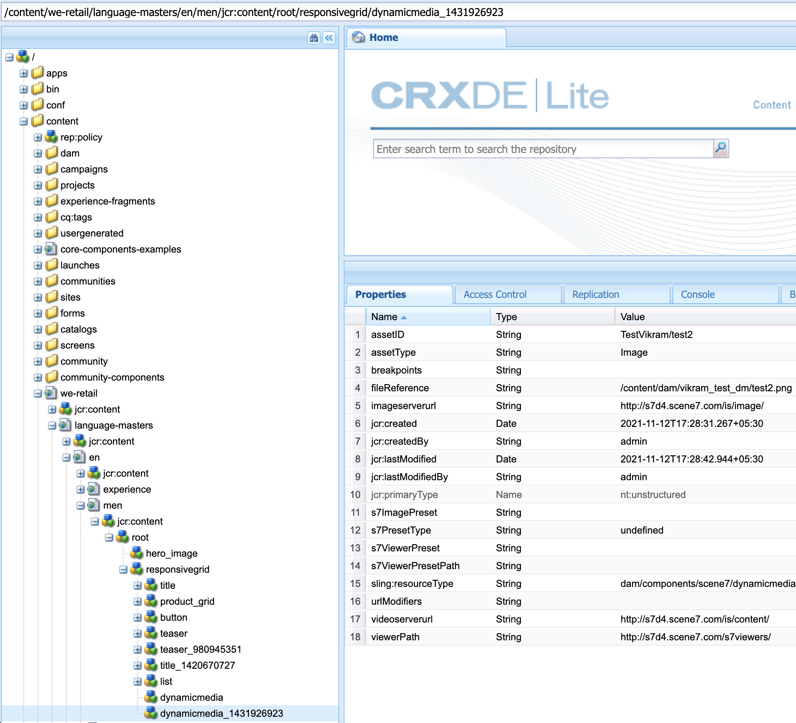
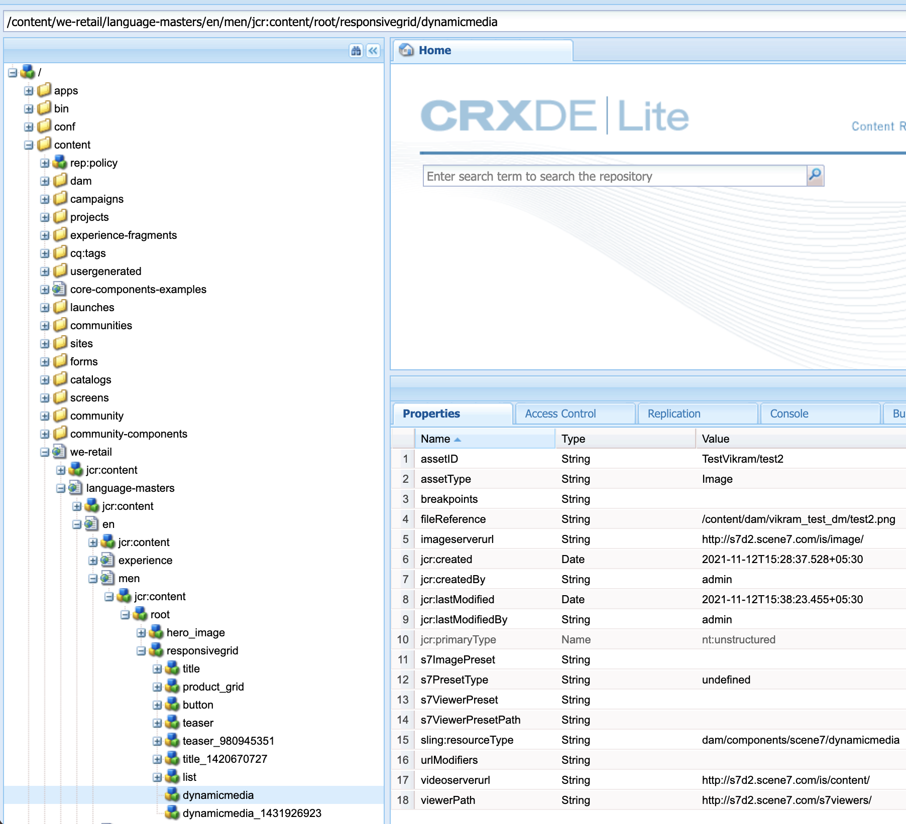

# Modifica dell’URL di Dynamic Media per le risorse DM

## Descrizione {#description}

<b>Ambiente</b>
- Experience Manager Assets
- Experience Manager 6.5

<b>Problema/Sintomi</b> Nell’istanza di authoring di Adobe Experience Manager (AEM) (versione 6.5.11 e successive), puoi utilizzare la sezione Impostazioni generali per configurare le impostazioni del server DM e modificare l’URL del server di pubblicazione o l’URL di Dynamic Media per le risorse DM.

Per aprire la pagina Impostazioni generali di Dynamic Media, fai clic su nella tua istanza di AEM Author <b>Strumenti </b>vai a<b> Risorse </b>vai a<b> Impostazione generale Dynamic Media</b>
     Assicurati di aver configurato Dynamic Media nella tua istanza di AEM Author, fai clic su <b>Strumenti</b> vai a<b> Cloud Services</b> vai a <b>Configurazione Dynamic Media</b>

Il nome server pubblicato è il server CDN (Content Delivery Network) utilizzato in tutte le chiamate URL generate dal sistema specifiche per il tuo account Dynamic Media.      Assicurati che il nome di dominio personalizzato sia mappato sul server CDN (Content Distribution Network) di Adobe o che, nel caso in cui utilizzi il nome di dominio del provider CDN, debba essere mappato sul server di origine\*

\*Per ulteriori informazioni, contatta il supporto Adobe Dynamic Media.

## Risoluzione {#resolution}

Dopo aver modificato il nome del server pubblicato, salva le modifiche. Non modificare <b>Nome server di origine</b> a meno che non sia richiesto da un tecnico del supporto Dynamic Media di Adobe.

Istruzioni per modificare il Nome server pubblicato per i componenti Dynamic Media esistenti nelle pagine Sites:

- Installa il pacchetto allegato per creare il nodo URL server di pubblicazione
- Una volta installato il pacchetto, noterai che 2 file sono stati creati sul tuo AEM Author

   - [/libs/dam/gui/content/s7dam/updatepublishserverurl](http://vgaur-wx-1:4502/crx/de/index.jsp#/crx.default/jcr%3aroot/libs/dam/gui/content/s7dam/updatepublishserverurl "Visualizza percorso in CRXDE Lite")
   - [/libs/dam/gui/components/s7dam/updatepublishserverurl/updatepublishserverurl.js](http://vgaur-wx-1:4502/crx/de/index.jsp#/crx.default/jcr%3aroot/libs/dam/gui/components/s7dam/updatepublishserverurl/updatepublishserverurl.jsp "Visualizza percorso in CRXDE Lite")p

.         

- &#x200B; &#x200B; &#x200B; &#x200B; &#x200B; Immettere il percorso AEM Sites sul parametro &quot;path&quot; su questo URL: http://aem-server:portnumber/libs/dam/gui/content/s7dam/updatepublishserverurl.html?path=/content/mysite&amp;update=true &#x200B; &#x200B; &#x200B; &#x200B; &#x200B; &#x200B; &#x200B;
- L’utilizzo di tale URL aggiornerà automaticamente gli URL DM per tutto il componente Dynamic Media su tutte le pagine Sites nel percorso AEM Sites menzionato e mostrerà questo tipo di output

Tutti gli URL dei componenti Dynamic Media verranno modificati in Nome server pubblicato per il sito AEM.
Questa è una visualizzazione del componente DM, utilizzando il vecchio nome server pubblicato

Questa è la visualizzazione del componente DM, il nome del server pubblicato cambia dopo aver raggiunto questo URL: http://aem-server:portnumber/libs/dam/gui/content/s7dam/updatepublishserverurl.html?path=/content/mysite&amp;update=true

Nota: Per ottenere un elenco di tutti i componenti Dynamic Media presenti nel percorso AEM Sites, puoi chiamare questo URL : <u style="text-decoration:underline">http://aem-server:portnumber/libs/dam/gui/content/s7dam/updatepublishserverurl.html?path=/content/mysite</u>

&#x200B; &#x200B; &#x200B; &#x200B; &#x200B; &#x200B;
