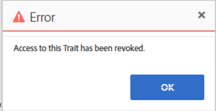

# Audience Manager: risoluzione dei problemi relativi ai modelli nell&#39;interfaccia utente AAM quando non è possibile salvare o ricevere errori

## Descrizione

<b>Dettagli domanda: </b>

<b>Domanda 1:</b> Non è possibile salvare il modello nell&#39;interfaccia utente AAM cliente anche se il limite di modelli non è stato raggiunto. Inoltre, durante il salvataggio del modello non si ottengono errori. Quando clicchi sul pulsante &quot;Salva&quot;, non accadrà nulla.

<b>Domanda 2: </b>Non è possibile disattivare o eliminare il modello nell&#39;interfaccia utente AAM cliente. Durante la disattivazione o l&#39;eliminazione si sta ottenendo l&#39;errore &quot;L&#39;accesso a questa caratteristica è stato revocato&quot;, si prega di trovare la schermata sottostante.

## Risoluzione

<b>Risposta 1:</b> Controlla tutte le caratteristiche utilizzate dai segmenti nel modello. Potrebbe essere possibile trovare una caratteristica presa dall’Audience Marketplace, ma una sottoscrizione per la modellazione non è abilitata per le caratteristiche che utilizzi nel modello. In questo caso, non sarà possibile salvare il modello. Per salvare il modello, rimuovi tutte le caratteristiche o abilita la sottoscrizione per la modellazione di queste caratteristiche. Tieni presente che, nel caso in cui desideri abilitare l’abbonamento per la modellazione, potrebbe essere necessario pagare costi aggiuntivi per questo.

<b>Risposta 2: </b>Uno dei possibili modi per superare questo problema:

Seleziona tutte le caratteristiche utilizzate dai segmenti nel modello che desideri disattivare o eliminare. Ci potrebbe essere la possibilità di trovare la caratteristica che non è disponibile controllare sotto screenshot:

Rimuovere tutte le caratteristiche non disponibili, quindi provare a disattivare o eliminare il modello. Ora è possibile disattivare o eliminare correttamente il modello.

*NB: Quando ricevi un messaggio di errore nell’interfaccia utente, puoi abilitare gli Strumenti per sviluppatori quando utilizzi [!DNL Chrome] e seleziona la scheda di rete, quindi prova a replicare nuovamente l&#39;azione precedente. È probabile che gli strumenti per sviluppatori presentino ulteriori dettagli, tra cui le dipendenze che impediscono di completare le azioni, questo può aiutarti a comprendere il motivo di un errore di interfaccia utente.*
