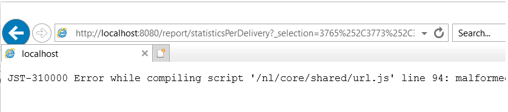

# Report di consegna: impossibile aggregare gli stati in ACC a causa della limitazione di IE

## Descrizione {#description}

<b>Ambiente</b><br>Campaign Classic<br>

<b>Problema/Sintomi</b>
Il problema è relativo alla lunghezza massima dell&#39;URL in Internet Explorer, che è di 2048 caratteri: [dettagli](https://support.microsoft.com/en-us/topic/maximum-url-length-is-2-083-characters-in-internet-explorer-174e7c8a-6666-f4e0-6fd6-908b53c12246).

L’origine HTML della pagina visualizza i rapporti all’interno del client ACC.

Gli URL all’interno degli attributi href dei tag a sono buoni, ovvero non vengono troncati. Tuttavia, se un URL viene copiato e incollato all’interno di IE, troncherà il collegamento a 2048 caratteri e non sarà in grado di aprirlo:



Lo stesso accade quando fai clic con il pulsante destro del mouse sul rapporto all’interno del client ACC e selezioni *&quot;Apri in una nuova finestra.&quot;* Questo aprirà automaticamente IE, ma la barra degli indirizzi sarà vuota. Se sono selezionate meno consegne e i passaggi vengono ripetuti, IE si aprirà con l’URL corretto.

Attualmente, è in corso uno sforzo per sostituire IE con Edge. Edge si basa su Chromium e non dispone di queste restrizioni URL. Questo è stato confermato copiando/incollando l’URL lungo in Edge, che non tronca l’URL e apre il rapporto senza alcun problema:


## Risoluzione {#resolution}


Questo problema deve essere risolto automaticamente al termine della transizione da IE a Edge. Fino ad allora, è possibile implementare la seguente soluzione alternativa:

- Copia l&#39;URL nel rapporto dal client ACC facendo clic con il pulsante destro del mouse sul rapporto e selezionando *la scelta rapida Copia*. Questo dovrebbe copiare l’intero URL negli Appunti.
- L’URL deve essere leggermente modificato per poter essere aperto in altri browser. L’URL copiato dal client seguirà questo pattern:


```
javascript:switchToReportView(%22statisticsPerDelivery%22,%20%22/report/statisticsPerDelivery?_selection=3765%252C37...
```


- La parte dell’URL che inizia da `/report/` deve essere copiato e aggiunto all&#39;indirizzo dell&#39;istanza. Ad esempio (in questo caso, l’indirizzo è localhost):


```
http://localhost:8080/report/statisticsPerDelivery?_selection=3765%252C3773%252C3781%252C3789%252C3793%252C3769%...
```


- Copia l’URL risultante in un altro browser: Edge, Firefox o Chrome dovrebbe funzionare correttamente.

