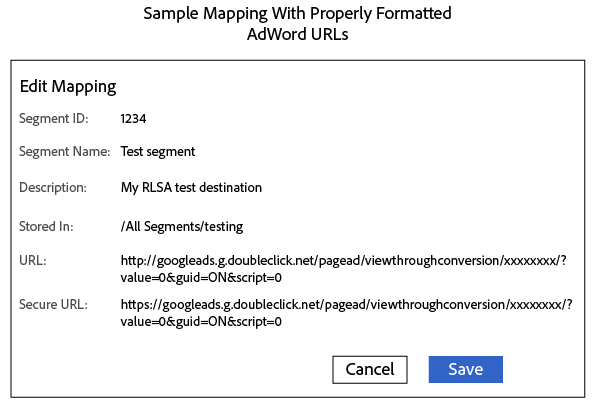

# [!DNL Google] Destinazione - AAM

## Descrizione

Questo articolo ha lo scopo di rispondere alle seguenti domande.

Domande:

1. Quanti tipi di integrazione sono disponibili per [!DNL google]?
1. Come si configura la destinazione S2S?
1. Come si fa a utilizzare RLSA?
1. Punti da ricordare

## Risoluzione

- Tipi di destinazioni
   - Destinazione S2S
   - Destinazione URL

### Destinazione URL - [!DNL Google Ads] Elenco remarketing

Di seguito sono riportati alcuni passaggi che è necessario seguire per impostare la destinazione dell’URL.

1. Nel tuo [!DNL Google Ads] account, [creare un elenco di remarketing per il sito web](https://support.google.com/adwords/answer/2454064?hl=en) e annota il tuo ID di conversione.

1. Utilizza l’URL seguente come modello per l’URL di base e l’URL sicuro. <b>Sostituisci la sezione &quot;xxxxxxxx&quot; con il tuo ID conversione.</b>

1. In AAM, crea una destinazione URL - Segui questo collegamento ([Creare una destinazione URL](https://experienceleague.adobe.com/docs/audience-manager/user-guide/features/destinations/custom-destinations/create-url-destination.html?lang=en)).

1. Nella sezione Mappature segmento della destinazione URL, aggiungi il codice del passaggio 2 ai campi URL e URL sicuro. Aggiungi al codice il prefisso http: and https: in rispettivamente i campi URL e URL protetto.

   Tieni presente che esistono due tipi di URL

   URL di base O codice URL non sicuro -<b> Inizia con HTTP</b>

   

   Codice URL protetto - <b>Inizia con HTTPS</b>

   

1. Fai clic su Salva.

1. In Audienci Manager, quando mappi un nuovo segmento a questa destinazione, definisci la mappatura come `aam=segmentID` e sostituisci `segmentID` con l’ID del segmento.

1. Quando si definisce un bucket in [!DNL Google Ads], crea una regola che corrisponda alla mappatura definita al passaggio 6.

   

### Destinazione S2S:

1. Per iniziare con la creazione della destinazione S2S per [!DNL Google], CC o Consultant verrà trasmesso con il tipo di account. Il tipo di account può essere dei seguenti tipi: INVITE_ADVERTISER , INVITE_PARTNER, DFP, ADX, ADX_PUBLISHER , DFP_BY_GOOGLE, DFP_BY_GOOGLE. Inoltre, tieni presente che questo tipo di risorsa deve essere inserito nella whitelist all’indirizzo [!DNL Google]La fine. (Il client può verificare con [!DNL Google]del team per questa parte).
1. Una volta ottenuti questi dettagli, CC o Consultant possono creare la destinazione.

Punti da ricordare:

- [!DNL Google] La configurazione di destinazione S2S supporterà il trasferimento di dati per TUTTI i seguenti 6 tipi di dispositivi:  <b>web-cookie / iOS-mobile / android-mobile/ [!DNL Roku] / [!DNL Microsoft] / [!DNL Amazon Fire TV]</b>.

- Per la creazione di URL per [!DNL Google Ads] Elenco delle annotazioni, assicurati di utilizzare <b>&quot;%ALIAS%&quot;</b> in entrambi i tipi di URL. Poiché si tratta di una macro che verrà sostituita in fase di esecuzione.

- Se riscontri un errore durante la creazione della destinazione S2S per [!DNL Google], verifica i punti di seguito.

   1. L’account deve essere inserito nella whitelist in [!DNL Google]La fine.

   1. Stai utilizzando dettagli corretti come (Protocollo, Server, Formato, Origine dati di Target, ecc.). Fai riferimento al collegamento nel segmento S2S.
