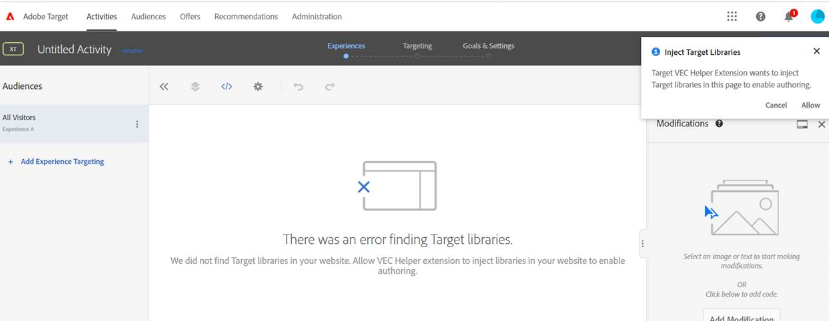

# Debug/risoluzione dei problemi del Compositore esperienza visivo di Target

## Descrizione

Impossibile caricare l’URL della pagina nel Compositore esperienza visivo di Adobe Target.

Di seguito sono riportati alcuni errori di esempio:

- 
- 
- 

## Risoluzione

1. Prova a cancellare i cookie e le cache o ad aprire il tuo sito web in modalità in incognito. 

1. Prova a utilizzare un browser alternativo, come - [!DNL Mozilla Firefox], [!DNL Microsoft Edge]

1. In questi casi di errore, installa l’estensione VEC Helper per browser

   1. Installa l&#39;estensione da [https://chrome.google.com/webstore/detail/adobe-target-vec-helper/ggjpideecfnbipkacplkhhaflkdjagak](https://chrome.google.com/webstore/detail/adobe-target-vec-helper/ggjpideecfnbipkacplkhhaflkdjagak)

   1. Per utilizzare l’estensione, fai clic sull’icona dell’estensione VEC Helper per nel tuo [!DNL Chrome] barra degli strumenti del browser quando si trova nel Compositore esperienza visivo. 

   1. Abilita &quot;**inserire librerie di destinazione**&quot; e &quot;cookies&quot; attivano &quot;on&quot;.

      

   1. Popup con la richiesta di consentire all&#39;estensione di aggiungere librerie di destinazione alla pagina per abilitare l&#39;authoring, che è necessario consentire.

   1. Consenti il contenuto non protetto dalle impostazioni del sito ([https://experienceleague.adobe.com/docs/target/using/experiences/vec/troubleshoot-composer/mixed-content.html?lang=en](https://experienceleague.adobe.com/docs/target/using/experiences/vec/troubleshoot-composer/mixed-content.html?lang=en))

      - Fare clic sull&#39;icona Blocca (avviso), quindi fare clic su Impostazioni sito.

      - Scorri fino al contenuto non protetto, quindi utilizza l’elenco a discesa per cambiare &quot;Blocca (predefinito)&quot; in &quot;Consenti&quot;.

      - Ricarica la pagina del Compositore esperienza visivo.
   1. Impostare Compositore esperienza avanzato come disattivato nei seguenti passaggi

      - Vai a [!DNL Target] - [!UICONTROL Amministrazione] - Compositore esperienza visivo- Disattivare il Compositore esperienza avanzato

         
   Nota: Se il problema persiste, apri la console per sviluppatori del browser e cerca un messaggio di errore.

1. La destinazione non è supportata se il sito web contiene iframe a più livelli. 

**Come accedere alle pagine post-login nel Compositore esperienza visivo**

1. Carica la pagina nel Compositore esperienza visivo e fai clic sulla &quot;scheda del browser&quot;, immetti le tue credenziali e quindi vai alla pagina che desideri. 
1. Fai clic su [!UICONTROL Componi] e apporta le modifiche all’interno del Compositore esperienza visivo. 

O

1. Apri un sito web in una nuova scheda e immetti le tue credenziali di accesso.
1. Apri Compositore esperienza visivo in [!DNL Target] e carica direttamente la pagina dopo l’accesso. 
1. A questo punto, la pagina verrà caricata nel Compositore esperienza visivo per apportare le modifiche.
