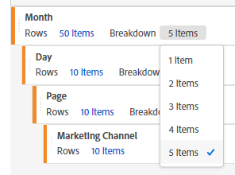

# Limitazione del numero di raggruppamenti durante la generazione di rapporti in [!UICONTROL Freeform Table Builder] (Generatore tabella a forma libera).

## Descrizione

Quando crei un rapporto in Generatore tabella che rappresenta una delle funzioni di Workspace in Adobe Analytics, il numero di [!UICONTROL raggruppamenti] è limitato a cinque elementi, a differenza di [!UICONTROL Righe]. 

## Risoluzione

In questo momento il numero massimo di [!UICONTROL raggruppamenti] è limitato a cinque elementi. Pertanto, al fine di visualizzare il risultato del [!UICONTROL raggruppamento] con un numero di elementi maggiore, è necessario creare un rapporto con Generatore tabella con cinque elementi e quindi impostare manualmente il [!UICONTROL raggruppamento] per quelli richiesti.

Ad esempio, se imposti “[!UICONTROL Rows]: 10 items” (Righe: 10 elementi) e “[!UICONTROL Breakdown]: 5 items” (Raggruppamento: 5 elementi), verranno scomposti solo i primi 5 elementi del rapporto visualizzato. In tal caso, dopo aver generato il rapporto, puoi aggiungere manualmente la scomposizione dei cinque elementi inferiori per confermare i risultati della scomposizione di tutte e dieci le voci. Se il rapporto è presente anche nella pagina successiva, il numero di risultati del [!UICONTROL raggruppamento] impostato manualmente, ovvero dieci, verrà visualizzato nella pagina successiva, quindi non è necessario impostarlo nuovamente.
