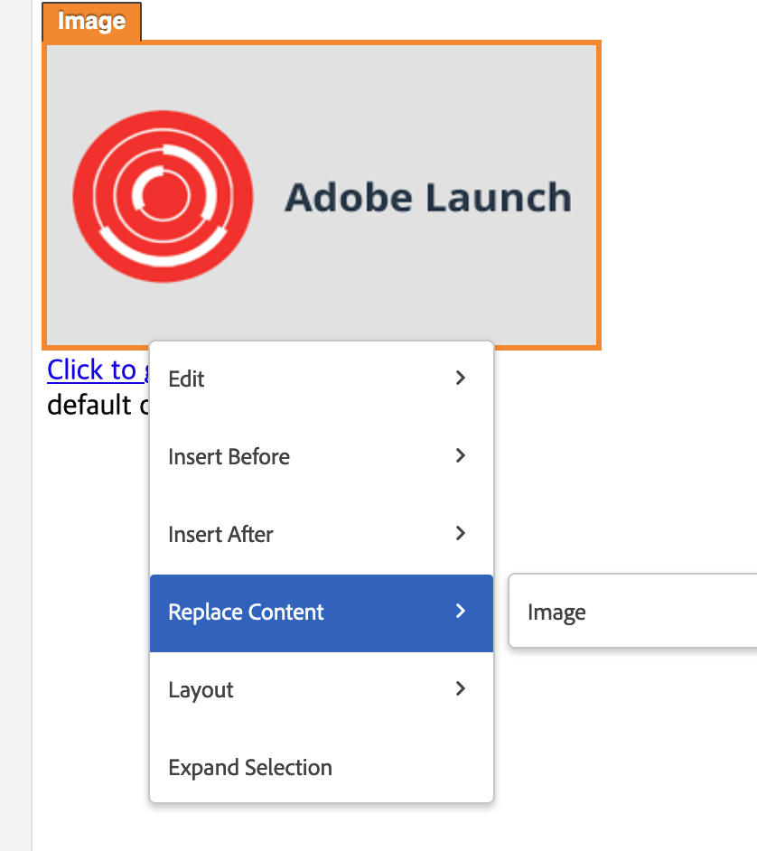
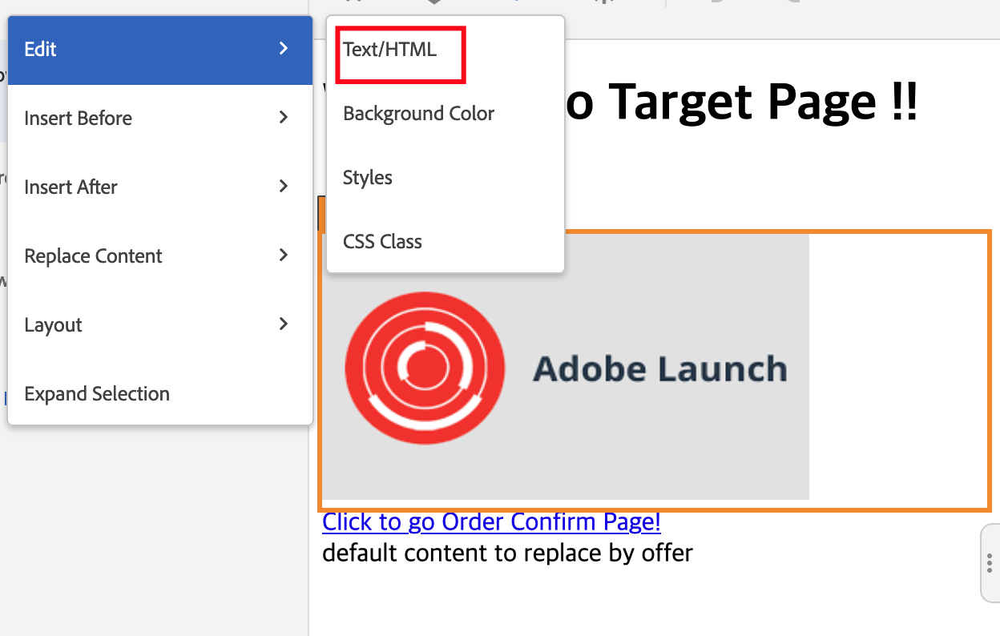

# L’immagine di scambio non funziona correttamente nel Compositore esperienza visivo di Target

## Descrizione

<b>Problema:</b> In Adobe Target VEC, dopo aver scambiato un’immagine su una pagina tramite Adobe Target VEC Replace Content Image (Compositore esperienza visivo), l’immagine non viene caricata correttamente o talvolta è possibile che venga visualizzata un’icona di errore nella finestra Modifiche sul lato destro della finestra di modifica del Compositore esperienza visivo.     

## Risoluzione

<b>Risoluzione: </b>Prova a utilizzare l’azione Modifica HTML sul contenitore principale facendo clic sul menu &quot;Espandi selezione&quot; e sostituisci il valore dell’attributo srcset nel codice HTML.

<b>Causa principale:</b> L’azione di sostituzione dell’immagine nel Compositore esperienza visivo si basa sull’attributo src del tag img e non funziona sull’attributo srcset.
