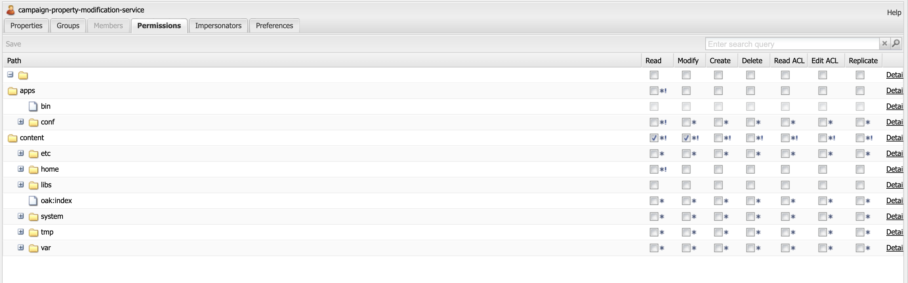

# I modelli e-mail AEM non vengono sincronizzati con Adobe Campaign.

## Descrizione {#description}

<b>Ambiente</b>

- Adobe Experience Manager

<b>Problema/Sintomi</b>

Quando un utente tenta di copiare e incollare il modello del sito su cui è già in esecuzione il flusso di lavoro di approvazione di Campaign, le proprietà cq:acLinks e cq:acUUID per Adobe Campaign non vengono rimosse.

Per questo motivo, la campagna Adobe non è in grado di sincronizzare il modello e-mail dall’AEM e restituisce un errore: acUUID duplicato trovato come cq:acLinks e cq:acUUID le proprietà sono univoche.

<b>Passaggi da riprodurre:</b>

1: Creare il modello e-mail di un sito in AEM.
2: Eseguire il flusso di lavoro di approvazione della campagna.
3: Approvare il modello completando i passaggi del flusso di lavoro.
4: Passa a crx/de.
5: il modello copiato/incollato conterrà le proprietà cq:acLinks e cq:acUUID.

<b>Errori nei registri:</b>

Non è possibile trovare errori correlati nei registri errori.

<b>Proprietà di Modello in crx/de dopo l’operazione di copia e incolla:</b>

<b>Esperto </b><b>Comportamento:</b>

<b>Previsto </b><b>Comportamento</b><b>:</b>

## Risoluzione {#resolution}

Il servizio campaign-property-modification-service è un utente del servizio che viene utilizzato per modificare le proprietà della newsletter della campagna nella funzione di copia e incolla.
Questo usercampaign-property-modification-service deve disporre delle autorizzazioni di lettura e modifica per la cartella dei contenuti.

Se non dispone delle autorizzazioni di lettura e modifica per la cartella dei contenuti, non può pulire le proprietà cq:acLinks e cq:acUUID del modello di sito incollato da una copia.

Dopo aver fornito all’utente le autorizzazioni necessarie, le proprietà vengono pulite.

<b>Schermata delle autorizzazioni utente:</b>

