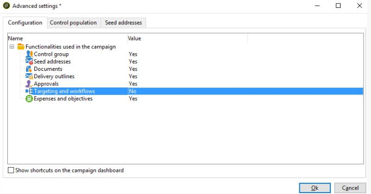

# Impossibile visualizzare il targeting e la scheda del flusso di lavoro in Campaign | Campaign Classic

## Descrizione {#description}

<b>Ambiente</b>

Adobe Campaign Classic

<b>Problema/Sintomi</b>

La scheda &quot;Targeting and Workflow&quot; non è visibile nella campagna. Ad esempio:
   

## Risoluzione {#resolution}

Questo problema si verifica perché l’opzione nelle proprietà del modello della campagna &quot;Funzionalità utilizzate nella campagna&quot; non è abilitata. Per risolvere questo problema:

- Controlla il modello di campagna associato alla campagna.
- Apri il modello della campagna.
- Vai a <b>Modifica</b>, quindi fai clic su <b>Parametri della campagna avanzati</b>.
- Sotto <b>Configurazione, s</b>Seleziona il valore Sì rispetto a Targeting e flussi di lavoro.

