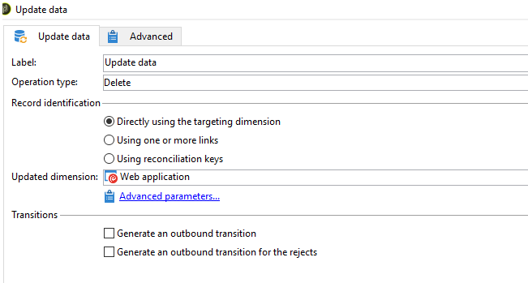

# Impossibile eliminare WebApp - ERRORE: il valore di chiave duplicato viola il vincolo univoco &quot;xtkdizionarystring_name&quot;

## Descrizione

Talvolta potresti non essere in grado di eliminare un&#39;applicazione WebApp e potresti riscontrare il seguente errore PGS-220000 Errore PostgreSQL: ERRORE: il valore di chiave duplicato viola il vincolo univoco &quot;xtkdizionarystring_name&quot;.

DETTAGLIO: Key (iobject, ssourceid, slocale) = (0, del_5818632_closedFormLog, en) esiste già.

## Risoluzione

Se si verifica questo errore in ACC durante l&#39;eliminazione dell&#39;app Web che non è più necessaria, la risoluzione sarà quella di eliminare webApp tramite Workflow (Come mostrato di seguito)

- Crea un nuovo flusso di lavoro e rilascia una query e aggiorna un’attività sull’area di lavoro.

- Esegui una query sulla chiave primaria dell’app Web e aggiorna il tipo di operazione come eliminazione nell’attività di aggiornamento dei dati. Nota che una volta eliminata l’app non può essere recuperata a meno che non venga eseguito un ripristino del database.

