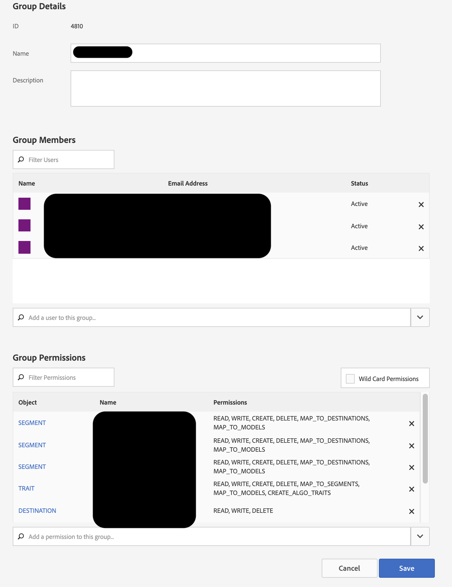

# Opzione AAM non visualizzata per collegare il gruppo AD al gruppo AAM

## Descrizione

Stai cercando di sincronizzare un profilo di prodotto di Admin Console con un gruppo di autorizzazioni RBAC di Audience Manager? Questo articolo può aiutare.

## Risoluzione

Nell’Admin Console sarà necessario l’accesso dell’amministratore ad Audience Manager e l’accesso dell’amministratore di prodotto.

1) Crea un gruppo di autorizzazioni RBAC in Audience Manager. Prendi nota del nome del gruppo di autorizzazioni scelto:

2) Passa al prodotto Audience Manager in Admin Console e crea un nuovo profilo di prodotto, selezionando il gruppo di autorizzazioni appena creato nel menu a discesa:

3) Aggiungi utenti rilevanti al profilo di prodotto appena creato:

