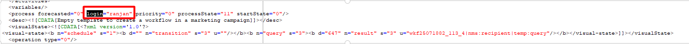

# Impossibile avviare il flusso di lavoro

## Descrizione {#description}


<b>Ambiente</b>

- Adobe Campaign Classic

- Adobe Campaign Classic v7

<b>Problema/Sintomi</b>

Il flusso di lavoro seguente non viene eseguito anche dopo aver modificato il campo &quot;creato da&quot; nelle proprietà del flusso di lavoro.

Nome interno flusso di lavoro: ``prdWKFXXXX``

Se si tenta di eseguire questo flusso di lavoro, il flusso di lavoro di monitoraggio dei processi della campagna (operationMgt) genera un errore di accesso non valido.

<b>Errori dal flusso di lavoro</b>: (Processi campagna(operationMgt))


```
BAS-010003 Unable to complete operation in current status.
WKF-560044 Error while sending notification with delivery template 'notify supervisor.' Please refer to the delivery log ID 00000 for more information (object associated with the workflow task).
DLV-490118 Error during preparation. Please refer to the delivery action journal '27626534' for more information.
SCR-160012 JavaScript: Error while evaluating script 'operationMgt/scheduler'.
XSV-350012 Invalid login or password. Connection denied.
```


Flusso di lavoro di targeting &#39;prdWKF0000&#39; avviato per la campagna &#39;Nome campagna (nome interno del flusso di lavoro)&#39;

<b>Analisi: </b>
All’avvio di questo flusso di lavoro: `prdWKF00000`, il flusso di lavoro Processi campagna (operationMgt) avviato non riesce. Dopo aver cercato ulteriori informazioni sulle possibili cause di questo problema e aver analizzato l&#39;XML del flusso di lavoro, è stato identificato il problema.


```
process forecasted="0" login="xxxxx@xxxx.com" priority="0"

           processState="20" startState="0"/
```


L’operatore menzionato sopra è stato disattivato, causando un errore nel flusso di lavoro dei processi di Campaign.


## Risoluzione {#resolution}


Sostituisci l’accesso con un operatore attivo, salva le modifiche nel flusso di lavoro ed esegui nuovamente il flusso di lavoro. Questo dovrebbe risolvere il problema.


```
process forecasted="0" login="ranjan" priority="0"
           processState="20" startState="0"/
```



