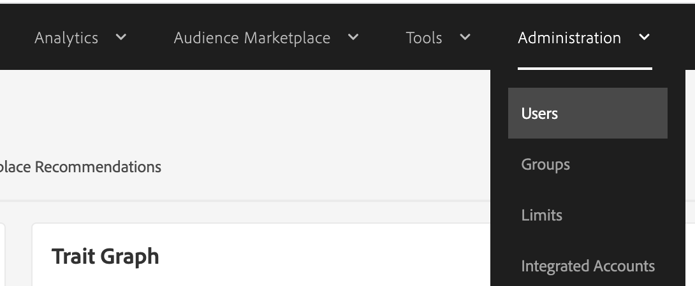
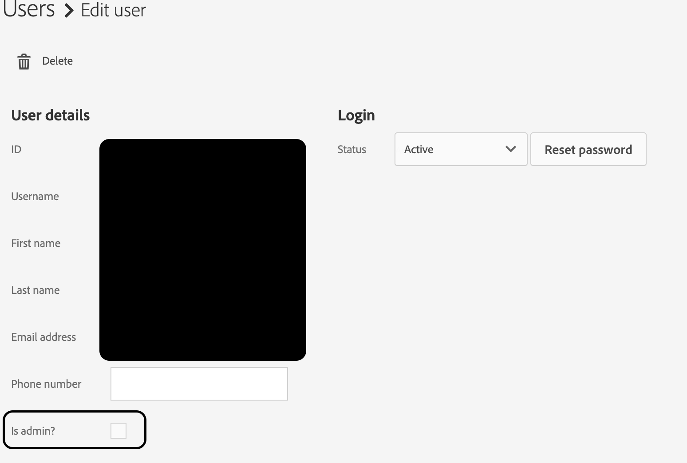

# Problemi di accesso in Adobe Audience Manager

Se dopo aver ricevuto l’accesso tramite l’Admin Console riscontri problemi di accesso in Adobe Audience Manager, segui i passaggi indicati in questo articolo per risolvere il problema.

## Descrizione {#description}

<b>Ambiente</b>
Adobe Audience Manager

<b>Problema/Sintomi</b>
In caso di problemi di accesso in Audienci Manager, anche se ti è stato concesso l’accesso tramite l’Admin Console, questi passaggi ti saranno di aiuto.

## Risoluzione {#resolution}

<b>Soluzione</b>
L’amministratore di sistema dell’AAM, nell’interfaccia utente di Audienci Manager stessa (non di Admin Console), può completare questi passaggi per concedere autorizzazioni di amministratore complete e incrementate nell’interfaccia utente di Audienci Manager.

I controlli RBAC possono essere utilizzati anche per concedere autorizzazioni più granulari.

Maggiori dettagli sul RBAC sono disponibili qui: [Amministrazione (controlli RBAC)](https://experienceleague.adobe.com/docs/audience-manager/user-guide/features/administration/administration-overview.html?lang=it) nella Guida utente di Adobe Audience Manager.

<u><b>Passaggi per concedere le autorizzazioni di amministratore di sistema AAM</b></u>

1. Passa ad Amministrazione `>`  Utenti.

   
2. Individuare l&#39;account utente in questione e abilitare <b>E&#39; Admin</b> casella di controllo per concedere autorizzazioni AAM complete.

