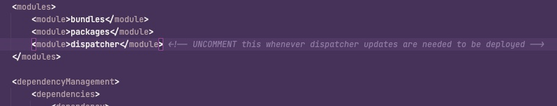

# Disattivazione della distribuzione di Dispatcher


Questo articolo ti guiderà attraverso la risoluzione del *Impossibile avviare Apache a causa di un errore di sintassi nelle configurazioni distribuite* errore che si verifica durante l’esecuzione di una pipeline di distribuzione.

## Descrizione {#description}


### <b>Ambiente</b>

Experience Manager 6.5


### <b>Problema/Sintomi</b>

Durante l’esecuzione della pipeline per la distribuzione, viene generato il seguente errore:


```
2022-06-21T14:16:54+0000 Deploy to instanceId=dispatcher1southafricanorth failed with errorCode=10011001 message=Failed to start Apache due to syntax error in deployed configurations. Config variables are not defined: DISP_LOG_LEVEL AH00534: httpd: Configuration error: No MPM loaded.
2022-06-21T14:16:54+0000 Failed to deploy dispatcher on instance dispatcher1southafricanorth. ActionId=671j71en7qt3mcp1mnlnjv13h9
2022-06-21T14:16:55+0000 Deploy to instanceId=dispatcher2southafricanorth failed with errorCode=10011001 message=Failed to start Apache due to syntax error in deployed configurations. Config variables are not defined: DISP_LOG_LEVEL AH00534: httpd: Configuration error: No MPM loaded.
2022-06-21T14:16:55+0000 Failed to deploy dispatcher on instance dispatcher2southafricanorth. ActionId=225ftn5ham417fmuaccae2n8ck
```


## Risoluzione {#resolution}


Commenta o rimuovi il modulo Dispatcher dall’elemento principale `pom.xml` (vedere di seguito). Quindi attiva nuovamente la pipeline. Ignora le modifiche del dispatcher e distribuisce solo la base di codice AEM su publisher e author.


