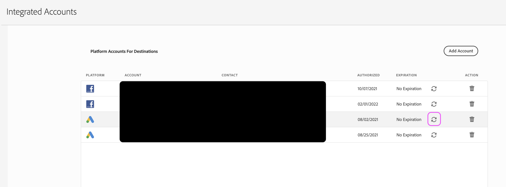

# Come aggiornare le credenziali dell’account integrato?

Scopri come mappare i segmenti su una destinazione associata a un account integrato.

## Descrizione {#description}

<b>Ambiente</b>

Adobe Audience Manager

<b>Problema/Sintomi</b>

Come si mappano i segmenti su una destinazione associata a un account integrato (ad esempio Facebook, Twitter o LinkedIn)?

## Risoluzione {#resolution}

Per completare questi passaggi, dovrai accedere all’interfaccia utente e alle credenziali dell’AAM per l’account integrato associato.

1. Passa alla pagina Account integrati dell’amministratore nell’interfaccia utente dell’AAM e individua l’account.
2. Fai clic sul pulsante circolare &quot;aggiorna&quot; all’estrema destra dell’account in questione:

   

3. A seconda del tipo di account, verrai portato sulla piattaforma associata per completare il flusso di lavoro di aggiornamento. Inserisci le credenziali per l’account e completa tutti i passaggi aggiuntivi come richiesto.

Se riscontri degli errori, prova a eseguire il processo un’altra volta dopo aver cancellato i cookie/cache o aver utilizzato un nuovo browser in incognito. Per completare questo processo, consigliamo inoltre di utilizzare Chrome rispetto ad altri browser.
