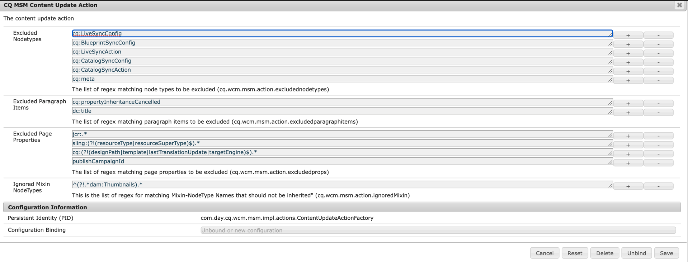

# Rollout non riuscito a causa di un mixin in conflitto (e utilizzando l’interfaccia classica)


Scopri come correggere gli errori di rollout dovuti a un mixin in conflitto (utilizzando l’interfaccia classica) con la configurazione dell’azione di aggiornamento del contenuto.

## Descrizione {#description}


Rollout di una pagina non riuscito a causa di alcuni conflitti *jcr:mixinTypes* nel nodo della miniatura della pagina.

Il conflitto si verifica quando la pagina è stata configurata con una miniatura <b>utilizzo dell’interfaccia classica</b> e poi, inizialmente, il suo rollout (primi lavori di rollout).

A questo punto, l’esecuzione di un rollout della pagina master non riesce a causa di un mixin in conflitto nella struttura delle miniature della pagina, tra:

- dam:Thumbnails
- cq:LiveRelationship


L’errore specificato nel registro è il seguente:


```
27.07.2022 15:48:07.091 *ERROR* [ 0:0:0:0:0:0:0:1 [ 1658929687039]  POST /bin/wcmcommand HTTP/1.1]  com.day.cq.wcm.msm.impl.commands.RolloutCommand Error during roll-out.
com.day.cq.wcm.api.WCMException: com.day.cq.wcm.api.WCMException: com.day.cq.wcm.api.WCMException: com.day.cq.wcm.api.WCMException: com.day.cq.wcm.api.WCMException: com.day.cq.wcm.api.WCMException: javax.jcr.nodetype.ConstraintViolationException: No matching node definition found for dam:thumbnails
    at com.day.cq.wcm.msm.impl.RolloutManagerImpl.rolloutResource(RolloutManagerImpl.java:824) [ com.day.cq.wcm.cq-msm-core:5.11.84] 
    at com.day.cq.wcm.msm.impl.RolloutManagerImpl.rolloutPage(RolloutManagerImpl.java:693) [ com.day.cq.wcm.cq-msm-core:5.11.84] 
    at com.day.cq.wcm.msm.impl.RolloutManagerImpl.rolloutPageRelations(RolloutManagerImpl.java:624) [ com.day.cq.wcm.cq-msm-core:5.11.84] 
    at com.day.cq.wcm.msm.impl.RolloutManagerImpl.rollout(RolloutManagerImpl.java:515) [ com.day.cq.wcm.cq-msm-core:5.11.84] 
    at com.day.cq.wcm.msm.impl.commands.RolloutCommand.performCommand(RolloutCommand.java:153) [ com.day.cq.wcm.cq-msm-core:5.11.84] 
    at com.day.cq.wcm.core.impl.commands.WCMCommandService$CommandHolder.performCommand(WCMCommandService.java:178) [ com.day.cq.wcm.cq-wcm-core:5.11.312] 
    at com.day.cq.wcm.core.impl.commands.WCMCommandServlet.performCommand(WCMCommandServlet.java:120) [ com.day.cq.wcm.cq-wcm-core:5.11.312] 
    at com.day.cq.commons.servlets.AbstractCommandServlet.doPost(AbstractCommandServlet.java:49) [ com.day.cq.cq-commons:5.11.18] 
    at org.apache.sling.api.servlets.SlingAllMethodsServlet.mayService(SlingAllMethodsServlet.java:146) [ org.apache.sling.api:2.20.0] 
    at org.apache.sling.api.servlets.SlingSafeMethodsServlet.service(SlingSafeMethodsServlet.java:342) [ org.apache.sling.api:2.20.0] 
    [ ..] 
Caused by: com.day.cq.wcm.api.WCMException: com.day.cq.wcm.api.WCMException: com.day.cq.wcm.api.WCMException: com.day.cq.wcm.api.WCMException: com.day.cq.wcm.api.WCMException: javax.jcr.nodetype.ConstraintViolationException: No matching node definition found for dam:thumbnails
    at com.day.cq.wcm.msm.impl.RolloutManagerImpl.rolloutResource(RolloutManagerImpl.java:824) [ com.day.cq.wcm.cq-msm-core:5.11.84] 
    at com.day.cq.wcm.msm.impl.RolloutManagerImpl.rolloutResource(RolloutManagerImpl.java:811) [ com.day.cq.wcm.cq-msm-core:5.11.84] 
    ... 135 common frames omitted
Caused by: com.day.cq.wcm.api.WCMException: com.day.cq.wcm.api.WCMException: com.day.cq.wcm.api.WCMException: com.day.cq.wcm.api.WCMException: javax.jcr.nodetype.ConstraintViolationException: No matching node definition found for dam:thumbnails
    at com.day.cq.wcm.msm.impl.RolloutManagerImpl.rolloutResource(RolloutManagerImpl.java:824) [ com.day.cq.wcm.cq-msm-core:5.11.84] 
    at com.day.cq.wcm.msm.impl.RolloutManagerImpl.rolloutResource(RolloutManagerImpl.java:811) [ com.day.cq.wcm.cq-msm-core:5.11.84] 
    ... 136 common frames omitted
Caused by: com.day.cq.wcm.api.WCMException: com.day.cq.wcm.api.WCMException: com.day.cq.wcm.api.WCMException: javax.jcr.nodetype.ConstraintViolationException: No matching node definition found for dam:thumbnails
    at com.day.cq.wcm.msm.impl.RolloutManagerImpl.rolloutResource(RolloutManagerImpl.java:824) [ com.day.cq.wcm.cq-msm-core:5.11.84] 
    at com.day.cq.wcm.msm.impl.RolloutManagerImpl.rolloutResource(RolloutManagerImpl.java:811) [ com.day.cq.wcm.cq-msm-core:5.11.84] 
    ... 137 common frames omitted
Caused by: com.day.cq.wcm.api.WCMException: com.day.cq.wcm.api.WCMException: javax.jcr.nodetype.ConstraintViolationException: No matching node definition found for dam:thumbnails
    at com.day.cq.wcm.msm.impl.RolloutManagerImpl.rolloutResource(RolloutManagerImpl.java:824) [ com.day.cq.wcm.cq-msm-core:5.11.84] 
    at com.day.cq.wcm.msm.impl.RolloutManagerImpl.rolloutResource(RolloutManagerImpl.java:811) [ com.day.cq.wcm.cq-msm-core:5.11.84] 
    ... 138 common frames omitted
Caused by: com.day.cq.wcm.api.WCMException: javax.jcr.nodetype.ConstraintViolationException: No matching node definition found for dam:thumbnails
    at com.day.cq.wcm.msm.commons.BaseAction.execute(BaseAction.java:154) [ com.day.cq.wcm.cq-msm-commons:1.1.2] 
    at com.day.cq.wcm.msm.impl.RolloutManagerImpl.rolloutResource(RolloutManagerImpl.java:790) [ com.day.cq.wcm.cq-msm-core:5.11.84] 
    ... 139 common frames omitted
Caused by: javax.jcr.nodetype.ConstraintViolationException: No matching node definition found for dam:thumbnails
    at org.apache.jackrabbit.oak.plugins.nodetype.EffectiveNodeTypeImpl.getNodeDefinition(EffectiveNodeTypeImpl.java:454) [ org.apache.jackrabbit.oak-core:1.8.22] 
    at org.apache.jackrabbit.oak.plugins.nodetype.ReadOnlyNodeTypeManager.getDefinition(ReadOnlyNodeTypeManager.java:396) [ org.apache.jackrabbit.oak-core:1.8.22] 
    at org.apache.jackrabbit.oak.jcr.session.NodeImpl$29.perform(NodeImpl.java:1031) [ org.apache.jackrabbit.oak-jcr:1.8.22] 
    at org.apache.jackrabbit.oak.jcr.session.NodeImpl$29.perform(NodeImpl.java:1023) [ org.apache.jackrabbit.oak-jcr:1.8.22] 
    at org.apache.jackrabbit.oak.jcr.delegate.SessionDelegate.perform(SessionDelegate.java:207) [ org.apache.jackrabbit.oak-jcr:1.8.22] 
    at org.apache.jackrabbit.oak.jcr.session.ItemImpl.perform(ItemImpl.java:112) [ org.apache.jackrabbit.oak-jcr:1.8.22] 
    at org.apache.jackrabbit.oak.jcr.session.NodeImpl.getDefinition(NodeImpl.java:1023) [ org.apache.jackrabbit.oak-jcr:1.8.22] 
    at com.day.cq.wcm.msm.commons.ItemFilterImpl.excludes(ItemFilterImpl.java:91) [ com.day.cq.wcm.cq-msm-commons:1.1.2] 
    at com.day.cq.wcm.msm.impl.actions.ContentCopyActionFactory$ContentCopyAction.applyFilters(ContentCopyActionFactory.java:293) [ com.day.cq.wcm.cq-msm-core:5.11.84] 
    at com.day.cq.wcm.msm.impl.actions.ContentCopyActionFactory$ContentCopyAction.createCopy(ContentCopyActionFactory.java:245) [ com.day.cq.wcm.cq-msm-core:5.11.84] 
    at com.day.cq.wcm.msm.impl.actions.ContentCopyActionFactory$ContentCopyAction.doExecute(ContentCopyActionFactory.java:208) [ com.day.cq.wcm.cq-msm-core:5.11.84] 
    at com.day.cq.wcm.msm.commons.BaseAction.execute(BaseAction.java:134) [ com.day.cq.wcm.cq-msm-commons:1.1.2] 
    ... 140 common frames omitted
```


<b>Passaggi da riprodurre:</b>

1. iniziare una vaniglia AEM 6.5.13.0
2. vai a <b>/siteadmin</b> (quindi utilizzando <b>Interfaccia classica</b>)
3. apri le proprietà della pagina di */content/we-retail/language-master/en/women*
4. nell&#39;immagine *scheda* imposta qualsiasi immagine come miniatura
5. eseguire il rollout della pagina
6. ora vai a <b>Interfaccia utente di Sites</b>
7. apri le proprietà della pagina per */content/we-retail/us/en/women* di nuovo
8. nel *Miniatura* , fare clic su *Genera anteprima* e salva la modifica
9. ora esegui nuovamente il rollout della pagina in /siteadmin


## Risoluzione {#resolution}


Questo problema si verifica durante il rollout perché l’AEM non è in grado di creare il nodo &quot;dam:thumbnails&quot; sotto jcr:content per la pagina Live Copy (/content/we-retail/us/en/women/jcr:content/image/file/jcr:content) e il motivo è che durante il rollout mixinType &quot;dam:Thumbnails&quot; non viene applicato al nodo della pagina Live Copy &quot;/content/we-retail/us/en/women/jcr:content/image/file/jcr:content&quot; e la cartella &quot;dam:Thumbnails&quot; può essere creata solo sotto &quot;dam:Thumbnails&quot; nodeType&quot;.

Il comportamento predefinito di MSM consiste nell’ignorare il nuovo mixin aggiunto ai nodi all’origine durante il rollout `[` 0`]`  pertanto non viene aggiunto a &quot;/content/we-retail/us/en/women/jcr:content/image/file/jcr:content&quot;.

Per risolvere il problema, questo comportamento può essere modificato tramite la configurazione dell’azione di aggiornamento del contenuto.
Per impostazione predefinita, ogni tipo di mixin viene ignorato, come illustrato nella schermata seguente:


Deve essere aggiornato per utilizzare:


```
(?!.*dam:Thumbnails).*
```


come mostrato nella schermata seguente:



Questo dovrebbe risolvere il problema.

`[` 0`]` https://experienceleague.adobe.com/docs/experience-manager-64/administering/introduction/msm-sync.html?lang=en#excluding-properties-and-node-types-from-synchronization
