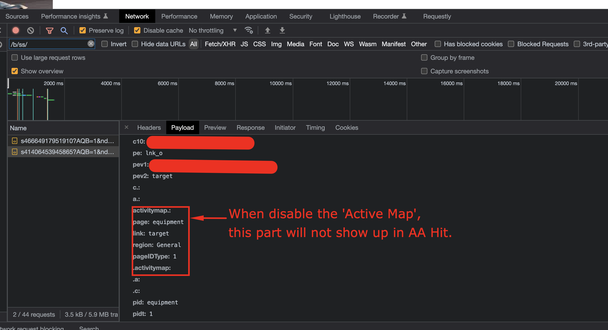

# Come disattivare la raccolta dati Active Map?

## Descrizione

Per qualche motivo, non vogliamo più raccogliere dati di Active Map; come possiamo disabilitare la raccolta dati di Active Map?
  

## Risoluzione

- <b>Se la libreria Adobe Analytics è gestita su un server del cliente (self-hosted di AppMeasurement.js )</b>

Eliminare il modulo AppMeasurement_Module_ActivityMap dal file AppMeasurement.js

- <b>Se la libreria Adobe Analytics è gestita sul lato Adobe ( AppMeasurement.js ospitato tramite la rete CDN di Adobe)</b>

Nell&#39;interfaccia utente di AEP Data Collection (Launch), vai alla configurazione di Adobe Analytics Extension, disattiva Activity Map deselezionando la casella, quindi pubblica la build

- 

- <b>Dopo aver disabilitato Active Map, controlla che il modulo Active Map non venga caricato tramite il menu &#39;console&#39; del browser con il comando &#39;s_c_il&#39;</b>

Il modulo Active Map è caricato

Il modulo Active Map non è caricato

- <b>Dopo aver disabilitato Active Map, controlla la chiamata al server Adobe Analytics tramite il menu del browser &#39;network&#39;.</b>.

