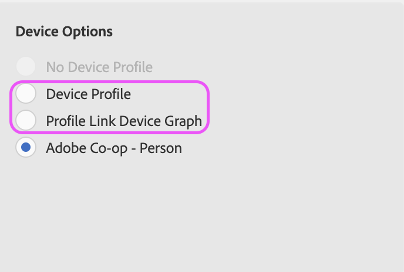

# Arresto del dispositivo co-op

## Descrizione

A partire dal 31 agosto 2022, Device co-op diventerà ufficialmente obsoleto. Questo articolo illustra l’impatto sui clienti e i passaggi necessari. 

## Risoluzione

Il lavoro di deprecazione per Device Co-op inizierà il 31 agosto 2022. Anche se l’opzione per selezionare la cooperativa potrebbe non essere inizialmente rimossa dall’interfaccia utente, il grafico dei dispositivi co-op stesso verrà rimosso, pertanto tutte le popolazioni di segmenti che utilizzano la cooperativa potrebbero riscontrare una notevole diminuzione delle dimensioni. Consigliamo a tutti i clienti di aggiornare le regole di unione dei profili (PMR) prima del 31 agosto 2022.

Per aggiornare le PMR, accedi a Regole di unione profili di pubblico e seleziona la regola in questione. In basso a destra della pagina di panoramica PMR, potrai aggiornare la selezione delle opzioni del dispositivo:

Seleziona &quot;Profile Link Device Graph&quot; (Grafico dispositivo collegamento profilo) per continuare il targeting per profili multi-dispositivo, oppure &quot;Profilo dispositivo&quot; per limitare la qualifica al dispositivo corrente. Maggiori dettagli sulle differenze tra queste due opzioni sono disponibili qui: [https://experienceleague.adobe.com/docs/audience-manager/user-guide/features/profile-merge-rules/merge-rule-definitions.html?lang=en#device-options](https://experienceleague.adobe.com/docs/audience-manager/user-guide/features/profile-merge-rules/merge-rule-definitions.html?lang=en#device-options)

Se si verificano problemi o conflitti durante il tentativo di aggiornare il PMR, è più probabile che ciò sia dovuto ai segmenti allegati e ai controlli di esportazione dei dati associati. In questo caso, consigliamo di creare un nuovo PMR (rivolgiti all’assistenza clienti per fornire una nuova regola se sei al limite): [https://experienceleague.adobe.com/docs/audience-manager/user-guide/features/profile-merge-rules/merge-rules-start.html?lang=en#profile-merge-rule-setup](https://experienceleague.adobe.com/docs/audience-manager/user-guide/features/profile-merge-rules/merge-rules-start.html?lang=en#profile-merge-rule-setup)

Quindi, lo strumento BAAAM può essere utilizzato per aggiornare tutti i segmenti rilevanti dal vecchio PMR co-op alla tua nuova regola creata: [https://experienceleague.adobe.com/docs/audience-manager/user-guide/reference/bulk-management-tools/bulk-management-intro.html?lang=en#actions-ops](https://experienceleague.adobe.com/docs/audience-manager/user-guide/reference/bulk-management-tools/bulk-management-intro.html?lang=en#actions-ops)

Se desideri rimuovere l’opzione co-op dall’interfaccia utente, regola i PMR come descritto in precedenza e apri una richiesta all’assistenza clienti per richiedere la rimozione di Device Co-op. Inoltre, non esitate ad aprire un ticket con eventuali domande o dubbi generali relativi a questo articolo o alla deprecazione generale di device co-op. Puoi anche consultare le nostre Domande frequenti per maggiori dettagli: [https://experienceleague.adobe.com/docs/device-co-op/using/about/device-co-op-eol.html?lang=en](https://experienceleague.adobe.com/docs/device-co-op/using/about/device-co-op-eol.html?lang=en)
