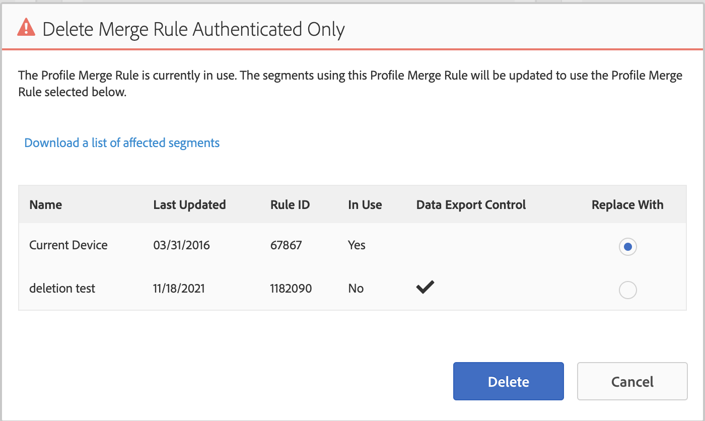

# Fine del Device Co-op

Questo articolo delinea l’impatto sui clienti e i passaggi necessari per rendere obsoleta la cessazione delle attività di device co-op.

## Descrizione {#description}

A partire dal 31 agosto 2022, device co-op diventerà ufficialmente obsoleto. Questo articolo illustra l’impatto sui clienti e i passaggi richiesti. 

## Risoluzione {#resolution}

Il lavoro di rimozione di Device Co-op inizierà il 31 agosto 2022. Anche se l’opzione per selezionare la cooperativa potrebbe non essere inizialmente rimossa dall’interfaccia utente, il grafico dei dispositivi della cooperativa stessa verrà rimosso, pertanto qualsiasi popolazione di segmenti che utilizza la cooperativa potrebbe riscontrare una notevole diminuzione nelle dimensioni. Consigliamo a tutti i clienti di aggiornare le regole di unione profili (PMR) prima del 31 agosto 2022.

Per aggiornare le PMR, passa a Dati pubblico `>`  Regole di unione profili e selezionare la regola in questione. Nella parte inferiore destra della pagina Panoramica PMR, potrai aggiornare la selezione delle opzioni del dispositivo:

Seleziona &quot;Profile Link Device Graph&quot; (Grafico dispositivo collegamento profilo) o &quot;Device Profile&quot; (Profilo dispositivo) per aggiornare il PMR. Ulteriori dettagli sulle differenze tra queste due opzioni sono disponibili qui: [https://experienceleague.adobe.com/docs/audience-manager/user-guide/features/profile-merge-rules/merge-rule-definitions.html?lang=en#device-options](https://experienceleague.adobe.com/docs/audience-manager/user-guide/features/profile-merge-rules/merge-rule-definitions.html?lang=en#device-options)

In caso di problemi o conflitti durante il tentativo di aggiornamento del PMR, ciò è probabilmente dovuto ai segmenti associati e ai controlli di esportazione dei dati associati. In questo caso, consigliamo di creare un nuovo PMR (contatta l’assistenza clienti per fornire una nuova regola se sei al limite): [https://experienceleague.adobe.com/docs/audience-manager/user-guide/features/profile-merge-rules/merge-rules-start.html?lang=en#profile-merge-rule-setup](https://experienceleague.adobe.com/docs/audience-manager/user-guide/features/profile-merge-rules/merge-rules-start.html?lang=en#profile-merge-rule-setup)

Se il vecchio PMR della cooperativa non viene più utilizzato, è possibile eliminare la regola. Selezionare il PMR appena creato dal passaggio precedente quando si dispone dell&#39;opzione:

In alternativa, è possibile [Strumento BAAAM](https://experienceleague.adobe.com/docs/audience-manager/user-guide/reference/bulk-management-tools/bulk-management-intro.html?lang=en) può essere utilizzato anche per aggiornare tutti i segmenti rilevanti dal vecchio PMR co-op alla nuova regola appena creata: [https://experienceleague.adobe.com/docs/audience-manager/user-guide/reference/bulk-management-tools/bulk-management-intro.html?lang=en#actions-ops](https://experienceleague.adobe.com/docs/audience-manager/user-guide/reference/bulk-management-tools/bulk-management-intro.html?lang=en#actions-ops)

I segmenti creati da un servizio, ad esempio i tipi di pubblico predittivi e basati su Experience Cloud (condivisi da Analytics), non possono essere modificati direttamente nell’interfaccia utente o tramite API. Se rilevi un errore durante il tentativo di eliminare il PMR e spostare i segmenti o riscontri problemi con singoli segmenti all’interno dello strumento BAAAM, compila un elenco di ID segmento problematici e apri un ticket presso l’assistenza clienti. 

Dopo aver aggiornato le regole come descritto in precedenza, se desideri rimuovere l’opzione co-op dall’interfaccia utente, apri un ticket di assistenza clienti per richiedere la rimozione di device co-op. Inoltre, non esitate ad aprire un ticket con eventuali domande o dubbi di carattere generale relativi a questo articolo o alla rimozione generale di device co-op.

Per ulteriori informazioni, consulta le domande frequenti: [https://experienceleague.adobe.com/docs/device-co-op/using/about/device-co-op-eol.html?lang=en](https://experienceleague.adobe.com/docs/device-co-op/using/about/device-co-op-eol.html?lang=en)
