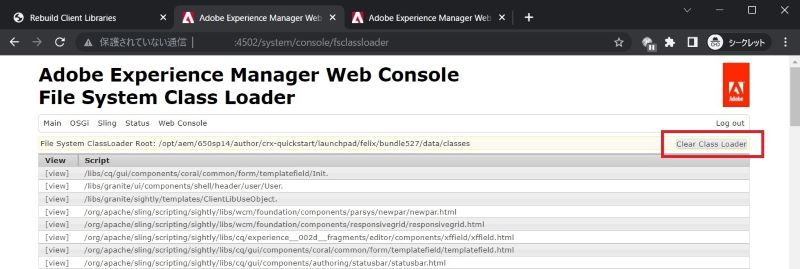

# Adobe Experience Manager: come cancellare la cache di HTL/JSP/JS/CSS per i componenti personalizzati

Quando modifichi i file HTL/JSP/JS/CSS per il componente personalizzato, l’AEM potrebbe non riflettere immediatamente le modifiche apportate alle pagine con il componente. Il motivo deve essere la cache interna. Questo articolo ti aiuterà a capire come cancellare la cache per questi file.

## Descrizione {#description}

### <b>Ambiente</b>

Experience Manager 6.5

### Problema/Sintomi

Quando modifichi i file HTL/JSP/JS/CSS per i componenti personalizzati, l’AEM potrebbe non riflettere immediatamente le modifiche apportate alle pagine con il componente. In questo caso, la causa potrebbe essere la cache interna.
Scopri come cancellare la cache di questi file.

## Risoluzione {#resolution}

Puoi cancellare la cache utilizzando le seguenti funzioni:

1. Librerie client: file JS/CSS

   Rigenera librerie client > Annulla validità cache o Rigenera librerie

      http://localhost:4502/libs/granite/ui/content/dumplibs.rebuild.html 

        
2. Caricatore di classe del file system: JSP, HTL

   Console Web > Sling > Caricamento classi file system > Cancella caricatore classi

      http://localhost:4502/system/console/fsclassloader

        
3. Cache script: file HTL, JS

   Console Web > Sling > Stato cache script > Cancella cache

      http://localhost:4502/system/console/scriptcache

        

Si consiglia di eseguire la cancellazione della cache in un momento non interattivo per evitare il deterioramento delle prestazioni.
Potrebbe essere necessario controllare anche la cache del dispatcher e quella del browser.
