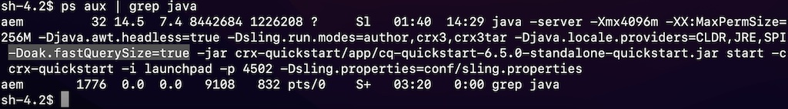

# Adobe Experience Manager: come controllare le configurazioni quando il numero di hit sembra errato

## Descrizione

Quando il numero effettivo di risultati di ricerca differisce dal numero di hit per una query, l&#39;opzione fastQuerySize può essere impostata come abilitata (true).
 Sono disponibili diversi modi per abilitare l’opzione fastQuerySize. Questo articolo spiega come configurare ogni modo.
  

## Risoluzione

<b>Configurazione OSGi</b>:Console web > Configurazione > Servizio impostazioni Apache Jackrabbit Query Engine > Dimensione risultati rapidi

http://localhost:4502/system/console/configMgr/org.apache.jackrabbit.oak.query.QueryEngineSettingsService Seleziona &quot;Fast result size&quot; (Dimensione risultati veloce) e Salva.
   

<b>Configurazione Java</b>:-Doak.fastQuerySize=true

Aggiungi la proprietà di sistema seguente nello script per l’avvio dell’AEM (crx-quickstart/bin/start).
        CQ_JVM_OPTS=&quot;${CQ_JVM_OPTS} -Doak.fastQuerySize=true&quot;

Questa configurazione sostituisce la configurazione OSGi.
    

<b>JMX</b>:Console web > JMX > org.apache.jackrabbit.oak: settings (QueryEngineSettings)

http://localhost:4502/system/console/jmx/org.apache.jackrabbit.oak%3Aname%3Dsettings%2Ctype%3DQueryEngineSettings Cambia &quot;Dimensione risultato veloce&quot; in true e Save.

Questo valore di configurazione in JMX prevale su altre configurazioni. Il riavvio di AEM reimposta il valore.

