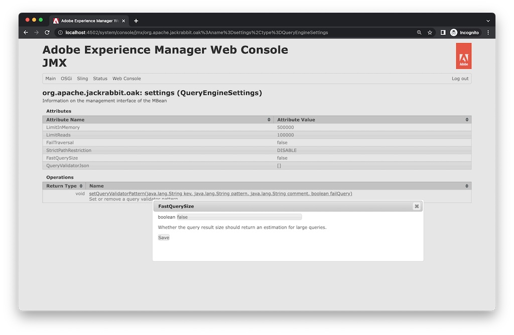

# Adobe Experience Manager: Come controllare le configurazioni quando il numero di hit sembra errato

## Descrizione

Quando il numero effettivo di risultati di ricerca differisce dal numero di hit per una query, l&#39;opzione fastQuerySize può essere impostata come abilitata (true).
 Sono disponibili diversi modi per attivare l&#39;opzione fastQuerySize. Questo articolo spiega come configurare ogni modo.
  

## Risoluzione

<b>Configurazione OSGi</b>:Console web > Configurazione > Apache Jackrabbit Query Engine Settings Service > Dimensione dei risultati rapidi

http://localhost:4502/system/console/configMgr/org.apache.jackrabbit.oak.query.QueryEngineSettingsService Controllare &quot;Fast result size&quot; e Save.
   

<b>Configurazione Java</b>:-Doak.fastQuerySize=true

Aggiungi la proprietà di sistema seguente nello script di avvio del AEM (crx-quickstart/bin/start).
        CQ_JVM_OPTS=&quot;${CQ_JVM_OPTS} -Doak.fastQuerySize=true&quot;

Questa configurazione sostituisce la configurazione OSGi.
    

<b>JMX</b>:Console web > JMX > org.apache.jackrabbit.oak: impostazioni (QueryEngineSettings)

http://localhost:4502/system/console/jmx/org.apache.jackrabbit.oak%3Aname%3Dsettings%2Ctype%3DQueryEngineSettings Cambiare &quot;Fast result size&quot; in true e salvare.

Questo valore di configurazione in JMX sostituisce altre configurazioni. Il riavvio AEM reimposta il valore.

