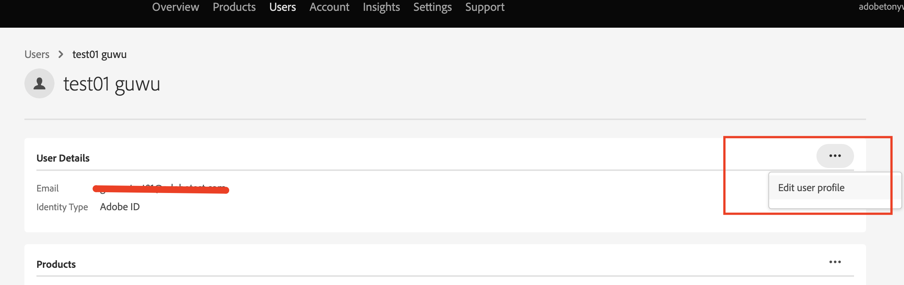

# Come aggiornare il nome ID utente in Admin Console?

Questo articolo fornisce informazioni su come aggiornare il nome dell’ID utente in Adobe Admin Console.

## Descrizione {#description}

### <b>Ambiente</b>

Analytics

### Problema/Sintomi

L’ID utente (Federated ID, Enterprise ID o Adobe ID) dispone dell’autorizzazione di amministratore di sistema, ma non <b>Modifica profilo utente</b> dell’ID utente nell’Admin Console non è visibile. Come aggiornare il nome ID utente, `test01 guwu` nell’immagine seguente? 

## Risoluzione {#resolution}

Tipo ID: Federated ID o Enterprise ID o Adobe
Chiedi a un altro utente amministratore di sistema della tua organizzazione di aggiornare il tuo profilo ID. Altri amministratori di sistema possono accedere a <b>Modifica profilo utente</b> del tuo ID utente tramite Admin Console.

Tipo ID: Business ID
L’opzione <b>Modifica profilo utente</b> non è disponibile per utenti di tipo <b>Business ID</b>. Ciò significa che tali utenti dovranno aggiornare i loro profili [qui](https://account.adobe.com/profile). Per ulteriori informazioni, consulta come [Aggiornare il tuo profilo account](https://helpx.adobe.com/it/manage-account/using/edit-adobe-account-personal-profile.html).
 
Riferimento: Fai riferimento al collegamento per ulteriori dettagli - [Gestire gli utenti singolarmente](https://helpx.adobe.com/it/enterprise/using/manage-users-individually.html)
