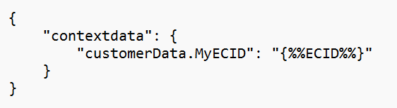

# Copiare un identificatore MID in un’eVar o una proprietà nell’SDK di AEP per dispositivi mobili

## Descrizione {#description}

Passaggi per copiare il MID in un’eVar o in una prop per l’SDK mobile di AEP

## Risoluzione {#resolution}

- &#x200B;&#x200B;&#x200B;&#x200B;&#x200B;&#x200B;&#x200B; &#x200B; &#x200B; &#x200B; &#x200B; &#x200B; &#x200B; &#x200B;Configura l’elemento dati in Adobe Launch per recuperare il valore MID. 
   - Configurazione:
      - Nome: ECID
      - Estensione - Mobile Core
      - Tipo di elemento dati: ID Experience Cloud &#x200B;&#x200B;&#x200B;&#x200B;&#x200B;&#x200B;&#x200B;
- Crea una regola Launch per inviare il MID sotto forma di dati contestuali.
   - Configurazione:
      - Eventi: estensione- core mobile, tipo evento- stato traccia<b> OPPURE</b>
      - Estensione- Mobile Core, Tipo evento- Traccia azione
      - Azioni: Estensione- Mobile Core, Tipo azione- Allega dati
      - Payload JSON- 
         - 
- Crea una Regola di elaborazione in Analytics per copiare il valore di MID in un eVar o in una prop.

   

