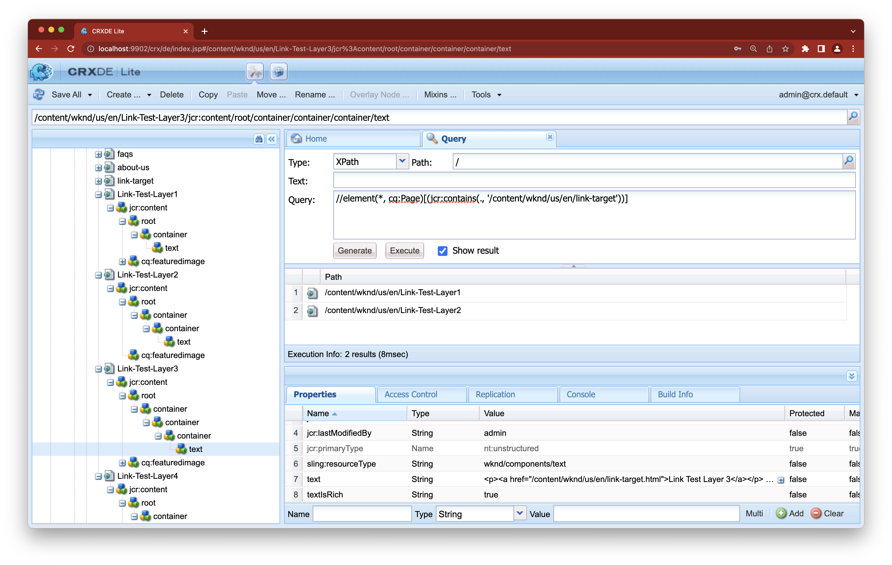

# I collegamenti in entrata non mostrano tutte le pagine di collegamento in Adobe Experience Manager


Se un nodo con un collegamento si trova a una profondità superiore a quattro livelli dal jcr:content della relativa pagina, la pagina non verrà visualizzata nei collegamenti in entrata della destinazione del collegamento in Adobe Experience Manager. Leggi questo articolo per scoprire perché questo accade.

## Descrizione {#description}


### <b>Ambiente</b>

- Adobe Experience Manager as a Cloud Service
- Adobe Experience Manager 6.5


### <b>Problemi/Sintomi</b>

Se un nodo con un collegamento si trova a una profondità superiore a quattro livelli dal jcr:content della relativa pagina, la pagina non verrà visualizzata nei collegamenti in entrata della destinazione del collegamento.

• Quando una pagina di collegamento viene visualizzata nei collegamenti in entrata:
  /content/wknd/us/en/link-page/jcr:content
  1) /root
  2) /container
  3) /container
  4) /text(link)

・ Quando una pagina di collegamento non viene visualizzata nei collegamenti in entrata:
 /content/wknd/us/en/link-page/jcr:content
 1) /root
 2) /container
 3) /container
 4) /container
 5) /text(link)


## Risoluzione {#resolution}


Controlla la gerarchia dei nodi che contengono il collegamento utilizzando CRXDE Lite.



Rivedi la struttura della pagina e regolala in modo che il nodo del collegamento possa essere posizionato a un livello superficiale.
Se il livello del nodo di collegamento rimane a un livello profondo, regola un indice per aumentare il livello da indicizzare per la ricerca dei collegamenti in arrivo.

Utilizzando CRX/DE Lite, seleziona


```
/oak:index/cqPageLucene/aggregates/cq:PageContent.
```

Crea un nuovo nodo e aggiungi una proprietà “percorso” che esprime il livello gerarchico richiesto.
- Nell’esempio seguente, vengono aggiunti “include4” e “include5” per aumentare il livello dei collegamenti in ingresso nella ricerca fino a 6.


Per eseguire la reindicizzazione, cambia il valore della proprietà reindex di `/oak:index/cqPageLucene` in true e salvalo.


  
    - Al termine della reindicizzazione, in error.log appare il seguente messaggio.

`    13.01.2023 12:00:45.264 *INFO* [ async-index-update-async]  org.apache.jackrabbit.oak.plugins.index.AsyncIndexUpdate [ async]  Reindexing completed for indexes: [ /oak:index/cqPageLucene*(788)]  in 733.7 ms (733 ms)`

La reindicizzazione può causare un problema di prestazioni.
    Si consiglia di pianificare l&#39;attività di reindicizzazione per un momento relativamente tranquillo.
