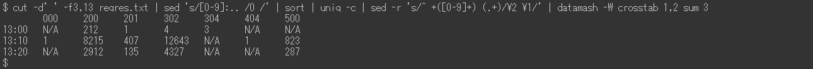

# Esempi di analisi request.log | AEM

## Descrizione {#description}

### <b>Ambiente</b>

Experience Manager 6.5

### <b>Problema/Sintomi</b>

Adobe Experience Manager (AEM) `request.log` contiene diverse informazioni utili, ad esempio il tempo di risposta, per analizzare i problemi di prestazioni. Di seguito è riportato un elenco di esempi di analisi con comandi Linux (inclusi alcuni comandi esterni come ruby) `[` 1`]`  e datamash `[` 2`]` ).

<u>Guide all’installazione</u>

`[` 1`]`  [https://www.ruby-lang.org/en/documentation/installation/](https://www.ruby-lang.org/en/documentation/installation/)

`[` 2`]`  [https://www.gnu.org/software/datamash/download/](https://www.gnu.org/software/datamash/download/)

## Risoluzione {#resolution}

### Sommario

<b>A. Introduzione</b>

- Formato di `request.log`

<b>B. Fasi di preparazione</b>

1. Pulizia dati
2. Ora di riavvio
3. Numero di accessi all&#39;ora
4. Massima elaborazione simultanea
5. Dividere un file di registro
6. Unisci record di richieste e record di risposta

<b>C. Esempi di analisi</b>

1. Gli accessi più pesanti
2. Accede alla risposta mancante
3. Accessi lenti
4. Dati della serie temporale del tempo di risposta
5. Tempo di risposta minimo, medio (medio), mediano, massimo
6. Numero di accessi per periodo
7. Numero di stati di risposta per periodo
8. URL più frequenti
9. `access.log` record per un `request.log` record

<b>D. Conclusione</b>

#### <b>R. <u>Introduzione</u></b>

Il formato di `request.log`

L’AEM 6.5 genera `request.log` nel seguente formato per impostazione predefinita. A causa di una limitazione del sistema, le righe di comando in questo articolo vengono visualizzate come immagini anziché come testo normale.

Esempio di `request.log`:

In questo articolo, una riga con &quot;-`>` &quot; è definito &quot;record di richiesta&quot;. Una riga con &quot;`<` -&quot; è un record di risposta.

<u>Richiedi record</u>:

Quando una richiesta viene ricevuta dall’AEM, viene registrato un record di richiesta. Contiene la data e l’ora di ricezione, l’ID della richiesta, il metodo di richiesta e l’URL.

<u>Record di risposta</u>:

Quando l’AEM risponde a una richiesta, viene registrato un record di risposta. Contiene la data e l’ora della risposta, l’ID della richiesta, il codice di stato, Content-Type e il tempo di risposta (in millisecondi).

Trovare il manuale corrispondente su [Interpretazione di request.log](https://experienceleague.adobe.com/docs/experience-manager-65/deploying/configuring/monitoring-and-maintaining.html#interpreting-the-request-log).

#### <b>B. <u>Passaggi di preparazione</u></b>

<u>Passaggio 1. Pulizia dati</u>

Prima di immergerti nell&#39;analisi di `request.log`, è importante standardizzare i record di registro.

Il primo `sed` Questo comando rimuove uno spazio aggiuntivo nei record di risposta Content-Type, per evitare la separazione errata dei campi con spazi vuoti. Il comando ruby (vedere <b>`[` 1`]` </b> sopra per installare Ruby) converte il formato della data in ISO 8601. Il comando ruby separa anche la data e l&#39;ora con uno spazio vuoto anziché due punti.

<u>Passaggio 2. Ora di riavvio</u>

Il riavvio dell’AEM e l’installazione di un service pack ripristina l’ID richiesta di `request.log`. Record della richiesta con richiesta `ID = 0` indica che potrebbero esserci questi tipi di operazioni.

Nell’esempio precedente, gli ID richiesta sono stati reimpostati su 0 a 13:08:49 e 13:26:13

<u>Passaggio 3: Numero di accessi all&#39;ora</u>

Contare il numero di accessi all&#39;ora e l&#39;intervallo di tempo del `request.log`.

<u>Passaggio 4. Massima elaborazione simultanea</u>

Il numero di elaborazioni simultanee consente di indovinare il carico del server dell’AEM.

Per impostazione predefinita, il numero massimo di connessioni simultanee per Jetty in AEM è impostato su 200. Si è verificato un ritardo nel rilascio del socket dopo il completamento della risposta. Quando il numero di elaborazioni simultanee supera circa 170, non può più accettare nuove richieste.

<u>Passaggio 5. Dividere un file di registro</u>

ID richiesta di `request.log` viene reimpostato al riavvio dell’AEM o all’installazione di un Service Pack. A causa di questo comportamento, l’analisi potrebbe non essere corretta quando `request.log` contiene tali operazioni. Per eseguire un&#39;analisi accurata e ridurre le dimensioni del file gestito contemporaneamente, suddividere `request.log` utilizzo dei record di richiesta con la richiesta `ID = 0`.

<u>Passaggio 6: Unisci record di richieste e record di risposta</u>

L’unione dei record di richieste e risposte per ID richiesta semplifica l’individuazione all’avvio dei problemi di prestazioni. Questo file di registro unito verrà utilizzato negli esempi successivi.

L&#39;ultimo `sed` Il comando aggiunge una risposta fittizia ai record di richiesta che non dispongono di un record di risposta corrispondente. Possono essere presenti anche record di risposta senza record di richiesta. Ma sono ignorabili in quanto di solito non sono un problema da indagare.

Il file di registro unito deve essere simile al seguente:

#### <b>C. <u>Esempi di analisi</u></b>

<u>Esempio 1. Gli accessi più pesanti</u>

Ordina il file di registro unito in base al tempo di risposta in ordine decrescente, inclusi gli accessi senza risposta.

<u>Esempio 2. Accede alla risposta mancante</u>

Gli accessi estratti non presentano i record di risposta corrispondenti utilizzando il tempo di risposta fittizio.

Se i tempi di ricezione degli accessi senza risposta sono correlati a un aumento del carico del server, questi accessi potrebbero aver provocato problemi di prestazioni.

<u>Esempio 3. Accessi lenti</u>

Estrarre gli accessi che hanno richiesto più di 10 secondi.

Quando il numero di hit è troppo elevato, sostituisci `[ 0-9] {5}` con `[ 0-9] {6}` nel `grep` per limitare l’accesso a accessi che hanno richiesto più di 100 secondi.

<u>Esempio 4. Dati della serie temporale del tempo di risposta</u>

Per creare i grafici, è utile estrarre dai dati solo la marca temporale e il tempo di risposta.

Omettendo gli accessi che hanno risposto immediatamente, i dati diventano più efficienti. Nell&#39;esempio seguente viene estratto l&#39;accesso che ha richiesto più di un secondo.

<u>Esempio 5. Tempo di risposta minimo, medio (medio), mediano, massimo</u>

Nell&#39;esempio precedente viene utilizzato il comando datamash (https://www.gnu.org/software/datamash/) per l&#39;elaborazione statistica. Se il registro contiene accessi senza risposta, il valore fittizio influisce sul risultato.

<u>Esempio 6. Numero di accessi per periodo</u>

Conteggio del numero di accessi per dieci minuti. Il risultato consente di determinare se un traffico elevato ha causato un problema di prestazioni.

Nell&#39;esempio seguente i dati vengono limitati alle sole richieste POST. Un caso d’uso tipico consiste nel determinare se c’è una concentrazione di authoring o replica di contenuti nel livello di pubblicazione.

<u>Esempio 7. Numero di stati di risposta per periodo</u>

Crea una tabella del numero di ciascuno stato di risposta per dieci minuti con il comando datamash.

<u>Esempio 8. URL più frequenti</u>

Stampa i primi tre URL a cui si accedeva più frequentemente in dieci minuti.

Esempio 9. `access.log` record per un `request.log` record

Ricerca `access.log` per i record che corrispondono a un determinato ID richiesta.

Se si sono verificati più accessi allo stesso URL contemporaneamente, il risultato mostra più `access.log` record per un singolo ID richiesta.

#### <b>D. Conclusione</b>

Gli esempi contenuti in questo articolo sono utili per analizzare i problemi di prestazioni.

Gli esempi elencati sono stati testati su CentOS 7.5 e Ubuntu 22.04LTS, ma potrebbero non funzionare come previsto a seconda dell’ambiente, ad esempio versioni o varianti diverse dei comandi. Regolarli in base ai comandi installati nell&#39;ambiente.
