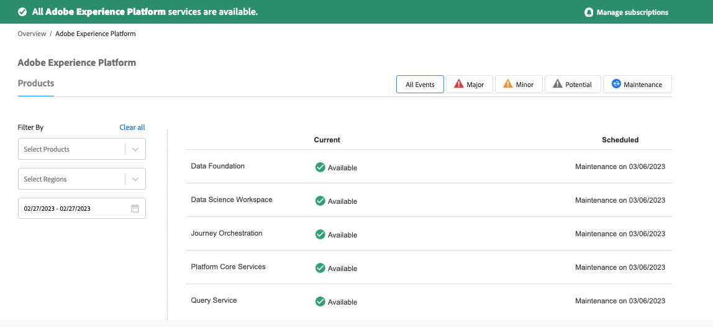

# Come determinare se Adobe Experience Platform è inattivo

Scopri come risolvere il problema di Adobe Experience Platform se qualcosa non funziona come previsto. Iscriviti agli avvisi/notifiche su inattività pianificata/non pianificata.

## Descrizione {#description}

<b>Ambiente</b>

- Adobe Experience Platform (AEP)
- Customer Journey Analytics

<b>Problema</b>

Adobe Experience Platform non funziona.

## Risoluzione {#resolution}

Se qualcosa non funziona come previsto, controlla la pagina Stato dell’Adobe all’indirizzo [Stato Adobe `>`  Experience Platform](https://status.adobe.com/cloud/experience_platform#/).

Adobe Status fornisce informazioni sulla disponibilità del servizio e sull&#39;impatto sulle prestazioni per tutti i prodotti e i servizi Adobe. Include gli incidenti e la manutenzione in corso o passati che influiscono sui prodotti Adobi.

<b>Nota</b>: puoi anche ricevere avvisi/notifiche su periodi di inattività pianificati/non pianificati.

Vedi l’esempio seguente:

