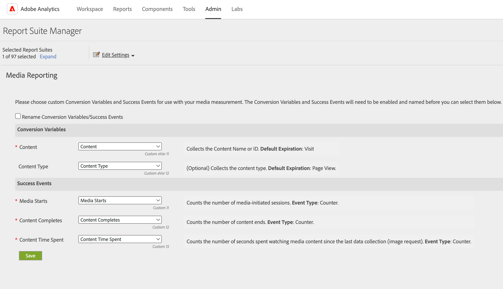

# Gli utenti non amministratori non possono ottenere dati per eVar specifiche

## Descrizione {#description}

<b>Descrizione</b> :

Gli utenti non amministratori visualizzano un errore di seguito e non vengono visualizzati dati quando tentano di ottenere dati per specifiche eVar in Analysis Workspace, anche se viene loro assegnato un profilo di prodotto che include l’accesso alle eVar specifiche per la suite di rapporti specifica.
Non hai accesso alla dimensione per questa richiesta.

## Risoluzione {#resolution}

Ciò accade se le eVar sono mappate su dimensioni utilizzate per Media Analytics.
Gli utenti amministratori possono controllare le impostazioni nella pagina Media Reporting.  Per ulteriori informazioni, consulta la pagina della guida in basso.
[https://experienceleague.adobe.com/docs/media-analytics/using/media-reports/media-reports-enable.html?lang=en](https://experienceleague.adobe.com/docs/media-analytics/using/media-reports/media-reports-enable.html?lang=en)
 
In questo caso, di seguito sono disponibili due opzioni per risolvere il problema.

- Gli utenti amministratori possono assegnare le dimensioni utilizzate per Media Analytics, come Contenuto e Tipo di contenuto, al profilo di prodotto in questione.
- Se non ti dispiace, gli utenti amministratori possono modificare le mappature delle dimensioni utilizzate per Media Analytics su variabili diverse nella pagina Media Reporting.  Ad esempio, puoi modificare la mappatura da eVar11 a una variabile diversa, ad esempio eVar13, per la dimensione Contenuto nel caso seguente.

