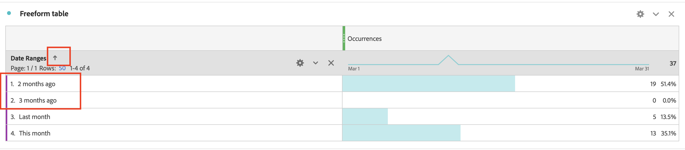

# Ordinare manualmente l’ordine del Dimension di intervalli di date nel rapporto Workspace

Questo articolo tratta i problemi di ordinamento relativi ai Dimension di intervalli di date nel Customer Journey Analytics Adobe Analytics. La soluzione consiste nell’utilizzare la funzione &quot;Generatore di tabelle&quot; per riordinare manualmente le dimensioni, consentendo un ordinamento personalizzato come &quot;Questo mese&quot; `>`  &quot;Mese scorso&quot; `>`  &quot;2 mesi fa&quot; `>`  &quot;3 mesi fa&quot;.

## Descrizione {#description}

<b>Ambiente</b>
Customer Journey Analytics Adobe Analytics

<b>Problema</b>
Desideri ordinare i Dimension di intervalli di date nell’ordine &quot;Questo mese&quot;, &quot;Ultimo mese&quot;, &quot;2 mesi fa&quot;, &quot;3 mesi fa&quot;.

Tuttavia, facendo clic sull’icona di ordinamento, questa viene visualizzata in un ordine diverso.
   Come ordinare manualmente l&#39;ordine del Dimension?  
            

## Risoluzione {#resolution}

È possibile ordinare manualmente i Dimension con la funzione &quot;Generatore tabella&quot;.

Apri una tabella a forma libera, quindi fai clic sul pulsante &quot;Abilita generatore di tabelle&quot;.

Trascinare i Dimension nella tabella nell&#39;ordine desiderato e fare clic sul pulsante Genera

Ora i Dimension vengono ordinati in base all&#39;ordine impostato per &quot;Questo mese&quot;, &quot;Ultimo mese&quot;, &quot;2 mesi fa&quot;, &quot;3 mesi fa&quot;

