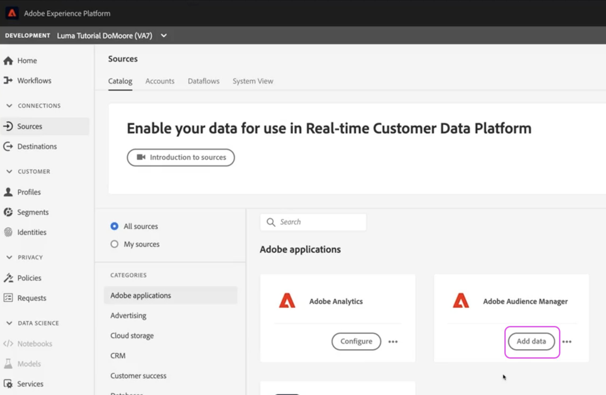

# Errore: Non è consentito eliminare a causa della condivisione dei segmenti abilitata

## Descrizione {#description}

<b>Ambiente</b>
- Audience Manager
- Experience Platform

<b>Problema/Sintomi</b>
Questo errore si verifica quando si tenta di eliminare una caratteristica o un segmento in AAM (Adobe Audience Manager). Il motivo di questo errore è perché la caratteristica o il segmento è condiviso dall’Audience Manager ad AEP (Adobe Experience Platform).

Di seguito sono riportati alcuni passaggi per risolvere il seguente errore: *Non è consentito eliminare a causa della condivisione dei segmenti abilitata*

## Risoluzione {#resolution}

Segui questi passaggi: 

1. Passa a <b>Origini</b> in AEP e apri le impostazioni per il connettore sorgente Audience Manager:

   

2. <b>Deseleziona</b> i segmenti da eliminare da AAM:

   
3. Una volta deselezionati i segmenti o le caratteristiche, fai clic su <b>Successivo</b> nell&#39;angolo in alto a destra. Nella pagina risultante, controlla le modifiche e fai clic su <b>Completato</b>.

Se condividi tutti i segmenti e le caratteristiche da AAM ad AEP, devi aggiornare la configurazione per condividere segmenti specifici o interrompere la condivisione dei dati per eliminare il segmento AAM.

