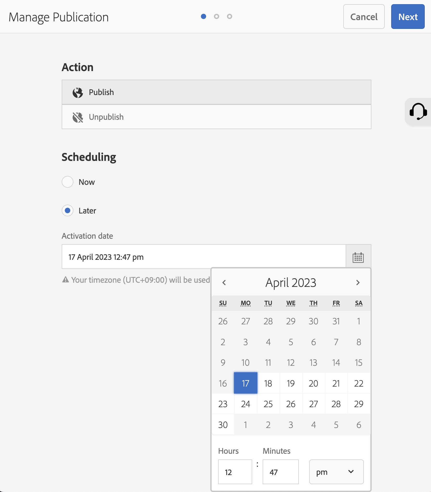

# Adobe Experience Manager: Come personalizzare il formato dell’ora della data di attivazione per Gestisci pubblicazione

## Descrizione {#description}

Questo articolo spiega come personalizzare il formato dell’ora della data di attivazione per Gestisci pubblicazione.      
<b>Ambienti</b>
AEM 6.5

## Risoluzione {#resolution}

Crea un dizionario i18n per la lingua di destinazione. I passaggi seguenti personalizzano il formato dell’ora per l’inglese da 12 ore a 24 ore.

Passaggio 1: Crea un formato ora personalizzato in sintassi Moment.js (https://momentjs.com/docs/#/i18n/) in formato 24 ore: &quot;2023/04/11 14:24&quot; &quot;AAAA/MM/GG HH:mm&quot;

Passaggio 2: Creare dati del dizionario con CRXDE Lite

- Crea una cartella i18n sotto il tuo progetto (/apps/wknd/i18n)
- Crea un file en.json sotto la cartella i18n (/apps/wknd/i18n/en.json)
- Aggiungi le seguenti proprietà al nodo del file :
   - Nome = jcr:mixinTypes, Tipo = Nome, Valore = mix:language
   - Nome = jcr:language, Tipo = String, Valore = en
- Contenuto del file: `{ "D MMMM YYYY hh:mm a" : "YYYY/MM/DD HH:mm" }`

Passaggio 3: Accedi alla schermata Gestisci pubblicazione per controllare la modifica Il nuovo formato ora potrebbe riflettersi dopo un periodo di tempo a causa della cache del browser

