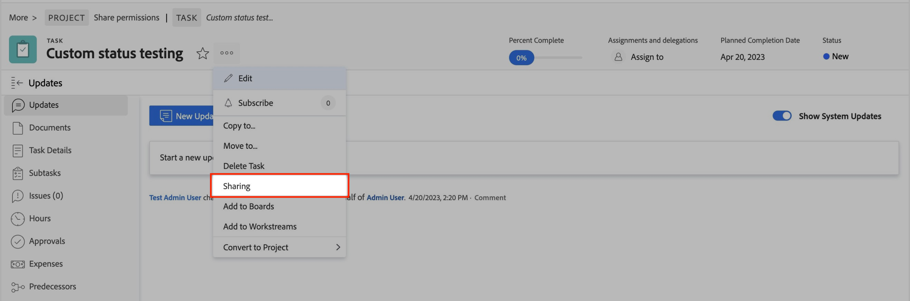

# Impossibile modificare i campi personalizzati | Workfront

Scopri come modificare i campi personalizzati in Workfront con i seguenti passaggi.

## Descrizione {#description}

### <b>Ambiente</b>

Workfront

### <b>Problema/Sintomi</b>

Esistono diversi scenari in cui un utente potrebbe riscontrare problemi nella modifica di campi personalizzati. Ad esempio, durante l’invio di una richiesta, la visualizzazione di un modulo personalizzato su un oggetto o la visualizzazione di campi personalizzati su un rapporto.

## Risoluzione {#resolution}

<b>Passaggio per risolvere:</b>
1. Assicurati che il modulo che contiene il campo sia allegato all’oggetto che stai tentando di modificare.
   1. Se un utente che non è amministratore desidera allegare un modulo all’oggetto, dovrà gestire l’accesso all’oggetto per allegarlo.
2. Verifica che tutti i dettagli nella condivisione del modulo siano corretti.
   1. Apri <b>Condivisione</b> impostazioni per l&#39;oggetto a cui è associato il modulo. Vedi di seguito:
   2. Cerca l’utente interessato nella <b>Condivisione</b>menu.
      - Se l’utente non è elencato, aggiungilo al <b>Condivisione</b> menu.
   3. Assicurati che l’utente disponga di <b>Contribuisci</b> autorizzazione con <b>Modifica modulo personalizzato</b> abilitato in <b>Impostazioni avanzate. </b>Vedi di seguito:
   4. <b>(Questo passaggio è facoltativo) </b>Se questo modulo fa parte di un<b> Coda richieste, </b>controllare le impostazioni di condivisione in<b> Coda richieste </b>anche moduli personalizzati. Vedi di seguito:

Per ulteriori informazioni, apri i seguenti collegamenti:

- [Modificare le informazioni nei campi modulo personalizzati](https://experienceleague.adobe.com/docs/workfront/using/basics/work-with-custom-forms/edit-custom-forms.html?lang=en)
- [Creare una coda di richieste](https://experienceleague.adobe.com/docs/workfront/using/manage-work/requests/create-and-manage-request-queues/create-request-queue.html?lang=en)
