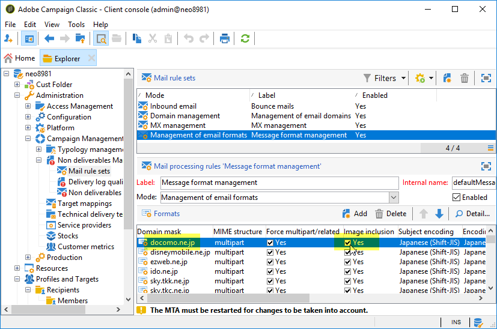

# Come evitare una consegna lenta delle e-mail a causa di destinatari Deco-mail?

## Descrizione {#description}

<b>Ambiente</b>

- Adobe Campaign Classic (ACC)
- Adobe Campaign Standard (ACS)

<b>Problema/Sintomi</b>

Una consegna tramite canale e-mail può essere molto lenta se la popolazione target include destinatari con <b>Deco-mail</b> formati e-mail.

Un destinatario ha <b>Deco-mail</b> formato e-mail in uno o entrambi i casi seguenti:

1. Il formato e-mail è impostato in modo esplicito su uno dei seguenti:
   - Deco-mail (DoCoMo)
   - Decoration Mail (KDDI AU)
   - Decore Mail (Softbank)         
2. Il dominio e-mail è configurato come `Image inclusion=yes`in:
   - <b>Campaign Management</b> › <b>Gestione non consegnabili</b> › <b>Gestione del formato dei messaggi</b>        

## Risoluzione {#resolution}

Per evitare questo rallentamento della consegna, prova quanto segue:

- Pulisce la popolazione target in modo che non includa alcun destinatario Deco-mail.
- Progetta il flusso di lavoro contenitore in modo da escludere i destinatari Deco-mail dalla popolazione target.
- Disattiva <b>Analisi per l&#39;integrazione automatica delle immagini</b>.

  

<b>Causa</b>

Se il destinatario ha un formato e-mail Deco, Campaign applica la regola di tipologia: <b>Analisi per l&#39;integrazione automatica delle immagini</b>. Converte i collegamenti immagine nell’e-mail inviata al destinatario della Deco-mail in file immagine allegati. La dimensione totale della consegna potrebbe crescere notevolmente e il throughput potrebbe rallentare in modo significativo.
