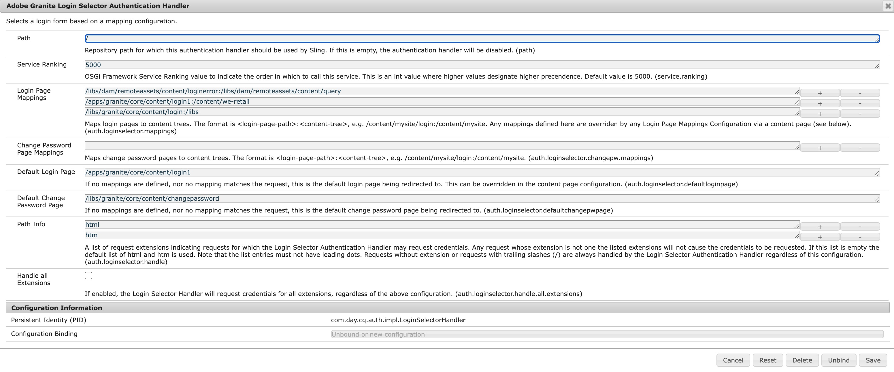

# Come reindirizzare alla pagina di accesso personalizzata in caso di errore del flusso OAuth dell’AEM

Scopri come reindirizzare alla pagina di accesso personalizzata in caso di errore del flusso OAuth dell’AEM reindirizzando gli utenti alla pagina di accesso personalizzata.

## Descrizione {#description}

### <b>Ambiente</b>

Experience Manager

### <b>Problema/Sintomi</b>

Come si reindirizza alla pagina di accesso personalizzata in un ambiente di pubblicazione Adobe Experience Manager (AEM) in caso di errore del flusso OAuth (AEM Open Authorization)?

## Risoluzione {#resolution}

Nel caso del flusso SAML (Security Assertion Markup Language)/OAuth, se si verifica un errore nel flusso di autenticazione dell’AEM, il sistema reindirizzerà alla pagina di accesso predefinita preconfigurata dell’AEM.

Pertanto, è necessario reindirizzare gli utenti alla pagina di accesso personalizzata dell’IDP SAML/OAuth. Segui i passaggi indicati di seguito:

1. Copia il percorso del nodo */libs/granite/core/content/login* a */apps/granite/core/content/login1* come indicato di seguito.
2. Modifica il tipo di risorsa di */apps/granite/core/content/login1* a <b>testservice</b>, come illustrato di seguito:
3. Creare un `rep:policy` nodo sotto login1 con <b>consenti elemento figlio</b>, come illustrato di seguito:
4. Creare un <b>testservice</b> cartella in <b>/apps</b> e aggiungi <b>sling:resourceType</b> con <b>testservice</b> e creare un file JSP denominato <b>testservice.jsp</b>, come mostrato di seguito: (Nota: in caso di flusso OAuth, assicurati di aggiungere */j_security_check?configid=`<` rispettivo oauth confiid`>`* al percorso di reindirizzamento protetto in <b>JSP</b> di seguito)
5. Apri la configurazione OSGI <b>Adobe Gestore di autenticazione del selettore di accesso Granite</b> e cambia la pagina di accesso predefinita in */apps/granite/core/content/login1* e personalizzare `auth.loginselector.mappings` per puntare alla pagina di accesso sovrapposta per il percorso protetto. Vedi di seguito:
6. Apri la configurazione OSGI <b>Servizio di autenticazione Apache Sling</b> e aggiungi *-/apps/granite/core/content/login1* e *-/apps/testservice* al `sling.auth.requirements` elenco. Vedi di seguito:
