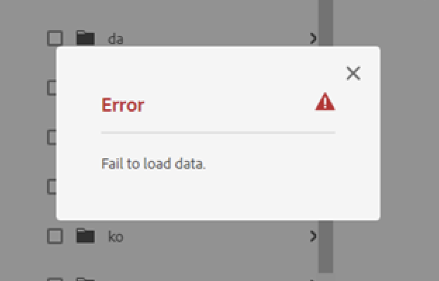

# L’aggiunta di risorse a un processo di traduzione non riesce e viene visualizzato l’errore &quot;Impossibile caricare i dati&quot;

## Descrizione {#description}

<b>Ambiente</b>
Experience Manager
<b>Problema/Sintomi</b>
Tentativo di aggiungere risorse da una cartella specifica a una <b>Lavoro di traduzione</b> non riesce con l’errore - *Impossibile caricare i dati*.

## Risoluzione {#resolution}

Dopo aver riprodotto il problema localmente, è stato rilevato che le risorse nella cartella che generano *Impossibile caricare i dati* sono stati danneggiati, con entrambe le opzioni `jcr:title` proprietà e `dc:title` metadati e `jcr:title` è stato definito come <b>stringa con più valori</b>.

Tipo di proprietà per `jcr:title` dovrebbe essere <b>Stringa</b>. Se questa veniva definita come array di stringhe, si verificava un errore di type-casting durante il caricamento della risorsa percorso dalla cartella.

Modifica del tipo di `jcr:title` su String e l’impostazione del titolo con il nome della risorsa risolvono il problema.
