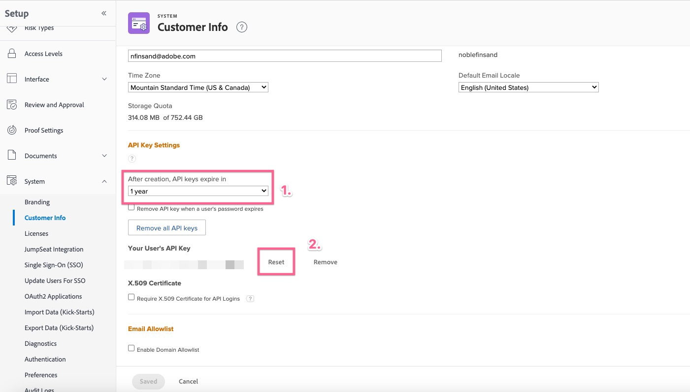

# Errore di richiesta errata durante la configurazione del componente aggiuntivo Workfront per Jira

## Descrizione {#description}

<b>Ambiente</b> Workfront   <b>Problema/Sintomi</b>
Quando si tenta di stabilire una connessione tra Workfront e Jira, è presente un errore di richiesta non corretto se in Workfront non è impostata alcuna chiave API valida per l’utente.

## Risoluzione {#resolution}

<b>Passaggi per risolvere:</b>
1. Accedi a <b>Workfront</b>, desideri stabilire la connessione con come utente.
2. Accedi a <b>Configurazione</b>.
   - Vai a <b>Sistema</b> `>`  <b>Informazioni Cliente</b> nel <b>Workfront</b>.
   - Controlla se *Chiave API* è presente in <b>Impostazioni chiave API</b> sezione.
3. Se un *Chiave API* non è presente:
   - Imposta una data di scadenza e fai clic su <b>Genera</b>.
4. Se è già presente una chiave API:
   - Verifica la durata del tempo impostato prima del *la chiave scadrà* e fai clic su <b>Reimposta</b>.
5. Vai a <b>Jira</b> e prova a riconnetterti al <b>Workfront</b>.

<b>Collegamenti rilevanti:</b>
- [Configurare Adobe Workfront per Jira](https://experienceleague.adobe.com/docs/workfront/using/adobe-workfront-integrations/workfront-for-jira/configure-workfront-for-jira.html?lang=en)
- [Gestire le chiavi API in Workfront](https://experienceleague.adobe.com/docs/workfront/using/administration-and-setup/manage-wf/security/manage-api-keys.html?lang=en)
