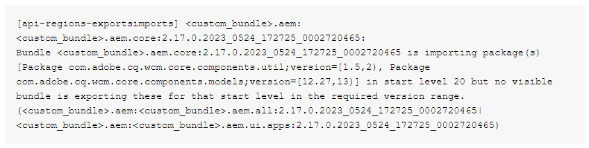

# Errore pipeline passaggio immagine di compilazione

Dopo aver aggiornato l’SDK locale e aver apportato modifiche alla *`<`aem-sdk-api`>`* nel *file pom.xml* nella directory principale del progetto, potrebbero verificarsi problemi con la pipeline. La pipeline genera un errore durante il passaggio di generazione dell’immagine. Per risolvere questo problema, è necessario effettuare il downgrade del *`<`aem-sdk-api`>`* a una versione precedente.

## Descrizione {#description}

### <b>Ambiente</b>

Adobe Experience Manager

### <b>Problema/Sintomi</b>

Dopo aver aggiornato l’SDK locale e modificato `<` aem-sdk-api`>`  del `pom.xml` nella directory principale del progetto possono verificarsi problemi con la pipeline.

Durante il passaggio di generazione dell’immagine, la pipeline non riesce.

Nei registri di build, i messaggi simili a `[` 1`]`  sono presenti.

<b>`[` 1`]` </b>

<b></b>

## Risoluzione {#resolution}

Secondo `[` 1`]` , il *`[`api-regions-exportsimports`]`* verifica se la dichiarazione Export-Package di altri bundle inclusi nel progetto Maven soddisfa le dichiarazioni Import-Package di tutti i bundle OSGI.

Per risolvere i problemi, verifica se il bundle che fornisce il pacchetto è incluso nella distribuzione. In alternativa, esamina il manifesto del bundle che prevedi di esportare per determinare se è stato utilizzato un nome o una versione errati.

Tuttavia, nel tuo caso, la spiegazione più plausibile per questo potrebbe essere che la tua istanza AEM sta ancora eseguendo la versione leggermente obsoleta `cq.wcm.core.components` che esporta una versione precedente di `com.adobe.cq.wcm.core.components.util` e `com.adobe.cq.wcm.core.components.models.`

Ma poiché il `aem-sdk-api` è stata aggiornata nella base di codice a una versione più recente, fa riferimento a una versione più recente di tali pacchetti.

Per risolvere il problema, effettuare il downgrade `aem-sdk-api`a una versione precedente.

Per ulteriori informazioni, consulta [Plug-in Maven per SDK Build Analyzer per AEM as a Cloud Service](https://experienceleague.adobe.com/docs/experience-manager-core-components/using/developing/archetype/build-analyzer-maven-plugin.html?lang=it) nella Guida dei Componenti core dell’AEM.
