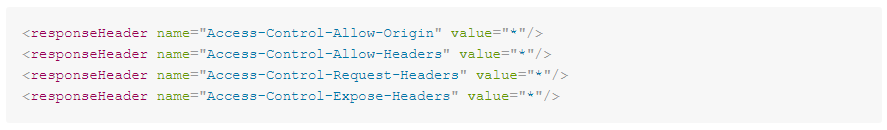

# Come correggere gli errori durante l’utilizzo delle estensioni .woff e .woff2?

## Descrizione {#description}


### Ambiente

Adobe Campaign Classic v7 (versione 7.2.2 - Build 9349)

### Problema/Sintomi

Dopo aver inserito nella whitelist i file .woff e .woff2 in un’istanza mid e aver utilizzato queste estensioni di file in un’app web, viene visualizzato il seguente errore:


```
Access to font at 'https://mkt-instance.campaign.adobe.com/res/mid-instance/file_example.woff2'
    from origin 'https://mkt-instance.campaign.adobe.com' has been blocked by 
    CORS policy: No 'Access-Control-Allow-Origin' header is present on the requested resource.
```


<u>Passaggi per riprodurre l’errore</u>:

1. Accedi all’URL dell’app web utilizzando i file .woff e .woff2.
2. Apri la console del browser Web e osserva l’errore relativo a questi file.


## Risoluzione {#resolution}


1. Aggiungi `Access-Control-Allow-Origin`, `Access-Control-Allow-Headers`, e `Access-Control-Allow-Methods` come responseHeader nella sezione relay del `serverConf.xml`:    
2. Aggiungi `Access-Control-Allow-Origin`, `Access-Control-Allow-Headers`, e `Access-Control-Allow-Methods` intestazioni su `apache_neolane.conf` in entrambi i contenitori app:    
3. Una volta salvati i due file, esegui un nlserver pulito e il riavvio di Apache su tutti i contenitori dell’istanza.


### Causa

L’errore viene generato perché nell’istanza mid manca la configurazione di `Access-Control-Allow-Origin`, `Access-Control-Allow-Headers`, e `Access-Control-Allow-Methods` intestazioni su `serverConf.xml` e il `apache_neolane.conf`.
