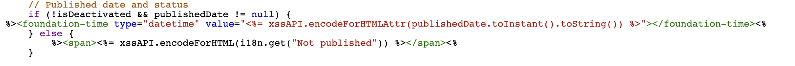

# Adobe Experience Manager: personalizzare il formato di visualizzazione della data di pubblicazione della pagina nella console Sites

## Descrizione {#description}

AEM La data di pubblicazione della pagina viene visualizzata nella console del sito, ma non l’ora.
In questa sezione viene illustrato come personalizzare il formato data/ora della data di pubblicazione in modo da includere l&#39;ora del giorno.

<b>Ambienti</b>
AEM 6.5, AEM as a Cloud Service

## Risoluzione {#resolution}

Crea una sovrapposizione per ciascuna delle viste a colonne e a elenco.

Per la vista a colonne, /libs/cq/gui/components/coral/admin/page/columnpreview/columnpreview.jsp è sovrapposto.
  Prima

After: aggiungi l’attributo type=&quot;datetime&quot; al tag di data e ora di fondazione.

Per la vista a elenco, /libs/cq/gui/components/coral/admin/page/row/row.jsp è sovrapposto.
  Prima

After: aggiungi l’attributo type=&quot;datetime&quot; al tag di data e ora di fondazione.

